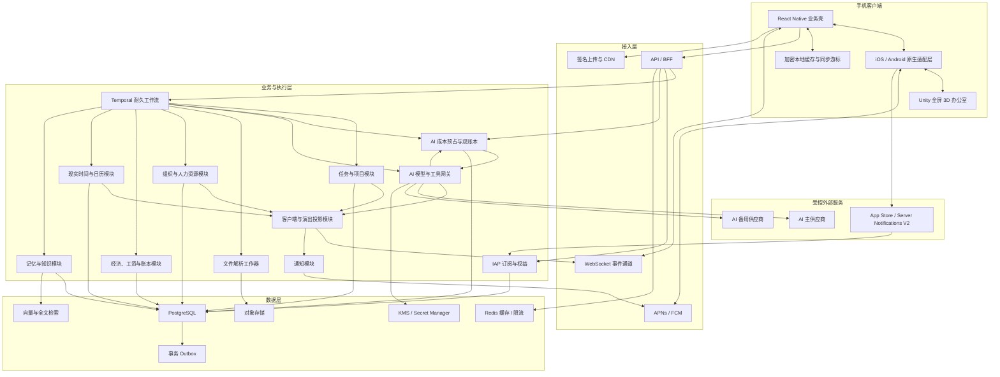
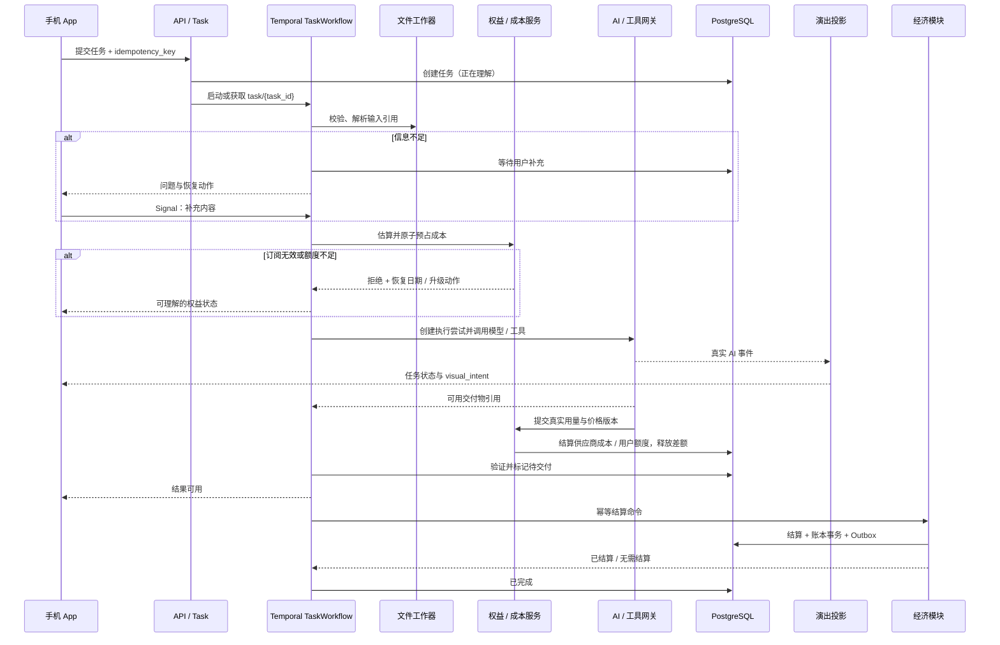
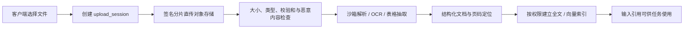

# 数字员工 App 技术设计

> 文档状态：技术方案讨论版 / 可进入技术验证
> 版本：v0.7
> 更新时间：2026-07-21
> 需求基线：《需求设计.md》v0.8
> 适用范围：手机客户端首版高质量垂直切片及后续演进
> 核心结论：采用“React Native 业务应用壳 + Unity 全屏 3D 办公室模块 + 云端耐久任务编排”的混合架构。

---

## 文档治理

### 文档目的

本文把《需求设计.md》中的产品规则转换为可以实施、验证和演进的技术方案，重点回答：

- 手机客户端、3D 引擎、服务端和 AI 能力如何分工；
- 为什么选择当前技术栈，以及不选择其他路线的原因；
- 真实任务状态如何驱动员工动画，避免伪造进度；
- 3D 办公室、角色、动画、模型和资源如何生产；
- 后台任务、重试、幂等结算、现实时间和离线恢复如何实现；
- 如何满足性能、安全、隐私、无障碍、监控和发布要求。

本文不替代接口 OpenAPI、数据库 DDL、Unity 资源规范表、模型提示词、视觉稿和测试用例。这些专项产物必须遵守本文的系统边界与不变量。

### 决策标识

| 标识 | 含义 |
|---|---|
| 已选基线 | 本文采用的默认技术方案，可以进入 PoC 和详细设计 |
| 技术建议 | 推荐方向，需通过原型、性能或成本测试确认 |
| 产品待定 | 依赖《需求设计.md》第 29 章产品决策，技术不能自行代替产品确认 |
| 验证门槛 | 未通过时不得进入大规模开发或美术生产 |
| 后续能力 | 不属于首版 P0，不得提前扩大首版范围 |

### 权威关系

- 产品行为、首版范围、用户权益和验收口径以《需求设计.md》为准；
- 本文负责技术实现边界、数据流、模块职责、资源管线和工程验收；
- 如果本文与需求文档冲突，以需求文档第 3 章核心不变量为最高产品约束；
- 本文中所有具体版本在项目启动时写入锁定清单，升级必须经过兼容性、性能和回归验证。

---

## 1. 技术选型结论

### 1.1 总体方案

**已选基线：混合客户端，不采用单一 UI 或单一 3D 技术承载全部产品。**

| 层级 | 技术基线 | 主要职责 |
|---|---|---|
| 移动业务 UI | React Native 0.86.x、TypeScript、New Architecture、Hermes | 登录、老板工作台、任务、结果、文件、人事、财务、设置、权限、无障碍 |
| 平台原生层 | Swift / Objective-C++、Kotlin / Java | Unity 生命周期、推送、文件、分享、相机、麦克风、支付、Keychain / Keystore、后台同步 |
| 3D 场景 | Unity 6.3 LTS、URP、C#、Unity as a Library | 全屏办公室、角色、寻路、动画、灯光、镜头、场景交互 |
| UI 动效 | React Native Reanimated 或等价的 New Architecture 兼容方案 | 页面转场、卡片、列表、手势、任务状态微动效 |
| 3D 资源制作 | Blender LTS、Substance Painter 或等价工具、统一导出脚本 | 场景、角色、道具、骨骼、动画、贴图和 LOD |
| API 与业务服务 | Node.js 24 LTS、TypeScript、NestJS + Fastify | 账号、任务、组织、人事、经济、权限、查询 API 和事件流 |
| 耐久工作流 | Temporal TypeScript SDK | AI 长任务、等待用户输入、重试、定时器、人事与工资流程 |
| 主数据库 | PostgreSQL 18 | 业务事实、任务状态、组织、记忆元数据、账本、审计和幂等记录 |
| 缓存与短期协调 | Redis 兼容托管服务 | 限流、短期缓存、连接状态和非权威协调数据 |
| 文件存储 | S3 兼容对象存储 + CDN | 用户原文件、解析产物、正式交付物和 Unity Addressables |
| 实时与通知 | WebSocket + REST 增量同步 + APNs / FCM | 前台状态事件、断线恢复和后台通知 |
| 可观测性 | OpenTelemetry + 托管日志、指标、追踪和崩溃平台 | 端到端任务追踪、性能、成本、错误和版本定位 |

AI 模型采用“平台托管多供应商 + App Store IAP 订阅 + 订阅周期成本配额”。用户不提供 API Key；平台使用生产供应商账户和服务端 AI Gateway 统一调用，每个任务在执行前原子预占成本，执行后按价格版本和实际用量结算。多供应商 Adapter 用于任务分层路由、区域合规与故障切换，不是用户配置界面。搜索、OCR、文档解析和外部工具同样进入成本账本和预算上限。

### 1.2 为什么这样选择

产品同时具有两种差异很大的界面：

1. **生产力界面**：长文本、表格、文件、表单、设置、支付、权限、动态字体和屏幕阅读；
2. **实时 3D 界面**：办公室、多人角色、寻路、骨骼动画、灯光、镜头和资源动态加载。

React Native 更适合第一类界面，Unity 更适合第二类界面。强行让 Unity 承担全部业务 UI，会提高长文档、系统权限、无障碍和平台适配成本；强行让 React Native 或 WebGL 承担复杂 3D 办公室，则会提高动画、骨骼、寻路、资源管线和移动 GPU 优化风险。

Unity as a Library 当前在 iOS 与 Android 上只支持全屏渲染、只能加载一个 Unity Runtime，卸载后仍可能保留约 80—180 MB 内存。因此办公室被设计为**独立全屏路由**，不是嵌入任务卡片中的任意尺寸组件。Unity 首次进入时按需加载，离开办公室时暂停；是否卸载由内存压力和返回频率决定，iOS 会话中不得调用完全退出后再尝试重载。

### 1.3 候选方案比较

| 方案 | 优点 | 主要问题 | 结论 |
|---|---|---|---|
| Unity 单体 App | 3D 与动画开发直接 | 长文本、文件、表格、支付、权限、无障碍和平台 UI 成本高 | 不采用 |
| React Native + WebGL / Three.js | 单一 TypeScript 技术栈 | 移动端骨骼动画、复杂场景、资源工具链和 GPU 稳定性风险高 | 不采用 |
| Flutter + Unity | Flutter 业务 UI 能力良好 | Unity 集成仍需双平台原生桥，团队生态与本方案相近但无额外决定性收益 | 备选，不作为基线 |
| iOS / Android 双原生 + 双 3D 实现 | 平台体验最直接 | 两套 UI 与渲染逻辑，成本和一致性风险过高 | 不采用 |
| React Native + Unity 全屏模块 | 业务 UI、平台能力和 3D 各自使用成熟工具 | 构建链、内存和桥接复杂度较高 | 采用 |
| 首版只做预渲染 2.5D | 包体与运行成本较低 | 角色移动、空间扩建、镜头与长期内容扩展受限 | 仅作为低性能降级方案 |

### 1.4 版本冻结原则

- React Native 以项目启动时的最新稳定受支持版本为候选，当前基线为 0.86.x；
- Unity 使用 Unity 6.3 LTS 的具体补丁版本，项目期间不跨 LTS 主线升级；
- Node.js 只使用 Active LTS 或 Maintenance LTS，当前基线为 24 LTS；
- PostgreSQL 使用云服务支持的稳定主版本，当前基线为 18；
- Unity、React Native、Xcode、Android Gradle Plugin、NDK 和原生 SDK 形成一份兼容矩阵并进入版本库；
- 锁文件、Unity `Packages/manifest.json`、Package Manager lock、Ruby Bundler 和原生依赖版本必须提交；
- Alpha、Beta、RC 版本不得进入发布分支，除非存在阻塞性平台兼容问题并有书面风险接受。

### 1.5 技术调研后的决策信心

固定前方俯视角使 2.5D 更可行，但没有消除模块化扩建、真实寻路、空间遮挡、共享骨骼、灯光和家具配置需求。经对 Unity、React Native Skia、Rive、Godot 与 Unreal 的官方支持边界调研，Unity 仍是唯一同时通过双平台嵌入、真 3D 空间和成熟资产管线硬门槛的首版方案。

当前渲染方向的工程准备度评估超过 90%，但这不等于整个项目已有 90% 的发布成功概率。整体落地还必须先通过《项目落地风险与验证计划.md》的 Gate -1 / Gate 0，以及第 9.7 节和第 15.1 节的双平台真机门槛。如果定向优化后仍未通过，按《技术调研与决策闭环.md》的退出条件降级为 Skia 分层办公室 + Rive 局部角色动画，同时删减无法低风险保留的真 3D 功能，不在 2.5D 中重写一套 Unity。

---

## 2. 需求约束转换

### 2.1 不可违反的技术不变量

1. **服务端事实权威**：任务、AI、人事、时间和账务状态以服务端为准，客户端和 Unity 不得自行改写。
2. **演出只做投影**：Unity 根据业务状态生成视觉表现，动画完成不能反向宣告 AI 已完成。
3. **AI 与演出并行**：信息充足后 AI 立即开始，不能等待角色走到房间、接起电话或完成会议动画。
4. **结果不被动画阻塞**：AI 结果可用后，用户跳过演出必须立即查看结果。
5. **员工人格不进入答案事实层**：人格只进入汇报表达与动作选择，不修改统一交付物的事实、数字、来源和限制。
6. **所有可重试写操作幂等**：任务提交、结算、发薪、资产购买、删除和未来外部操作必须携带幂等键。
7. **账本不可由客户端计算**：余额、利润、工资应付和资产变更由服务端事务产生，客户端只显示。
8. **手机后台不持续渲染**：App 退到后台后 Unity 暂停，真实任务由云端继续。
9. **关键功能具有非 3D 入口**：任务、结果、人事、财务和设置必须在标准移动页面可完成。
10. **真实与虚拟分离**：虚拟工资、利润和设备不得控制用户订阅和剩余 AI 算力额度允许的能力，也不得伪装真实外部操作。
11. **模型成本必须可预算**：付费 AI 调用只能在有效权益周期内执行，并且在调用前已完成原子成本预占；已结算、已预占与本次最大成本之和不得超过单用户和平台上限。
12. **路由不越权也不超支**：任务只能使用用户已同意、能力和质量满足、数据政策兼容且处于成本上限内的平台供应商配置；不能为成功率静默跨区、跨供应商或超过预占。
13. **双账本分离**：供应商成本账本记录所有实际成本，用户额度账本记录用户权益消耗；失败且未交付有效结果时不重复扣用户额度。

### 2.2 首版技术目标

- 支持需求文档规定的三类 AI 任务；
- 完成“提交任务 → 云端执行 → 真实状态 → 3D 演出 → 结果交付 → 幂等结算 → 资产成长”垂直链路；
- 支持 App 锁屏、退出、断网、进程被杀和换设备后的任务恢复；
- 支持 3 名核心员工、1 名秘书、少量普通员工和 4—5 个首版房间；
- 支持招聘到离职或解雇、工资和加班的基础人力资源闭环；
- 在基准设备上保持 30 FPS，并提供减少动态效果和非 3D 降级入口；
- 对任务、AI 调用、结算、文件和通知建立端到端追踪。

### 2.3 首版技术非目标

- 不实现多个独立 AI 智能体互相自由对话；
- 不让 Unity 在手机后台持续运行公司模拟；
- 不首发真实发送邮件、创建日程或发布内容；
- 不首发大型开放世界、自由摇杆控制或高写实渲染；
- 不首发多人实时协作；
- 不为未来假设拆成大量微服务；
- 不将 Redis、客户端缓存、Temporal 历史或 Unity 存档作为业务主数据库。

---

## 3. 总体系统架构

### 3.1 架构图



### 3.2 架构风格

首版服务端采用**模块化单体 + 独立工作器**，不采用按名词拆分的微服务群。

部署单元建议为：

- `api`：REST、WebSocket、鉴权、查询和命令入口；
- `workflow-worker`：Temporal 工作流与业务协调；
- `ai-worker`：模型和允许的工具调用；
- `file-worker`：文档、表格、图片和 OCR 处理；
- `notification-worker`：推送、摘要和通知偏好；
- `scheduler-worker`：公司时区、工资日、考勤和离线事件；
- `asset-cdn`：Unity Addressables 与静态资源分发。

模块之间通过清晰的领域接口、数据库事务和 Outbox 事件协作。只有在独立扩缩容、故障隔离或合规边界被真实证明后，才拆为微服务。

### 3.3 领域模块职责

| 模块 | 写入权 | 不允许承担的职责 |
|---|---|---|
| Task / Project | 任务主状态、项目、版本、负责人、依赖 | 不直接调用 Unity、不直接修改账本 |
| Billing / Entitlement | Apple 交易、订阅状态、权益周期和套餐 | 不从客户端自报状态发放权益 |
| AI Cost / Usage | 成本预占、供应商成本账本、用户额度账本和对账 | 不修改虚拟经济账本、不依赖 Redis 作为余额权威 |
| AI Gateway | AI 执行尝试、模型与工具结果 | 不修改任务主状态、不直接发项目收入 |
| Visual Projection | `visual_intent` 和客户端视图模型 | 不成为业务事实来源 |
| Organization / HR | 员工、人事状态、汇报关系、排班 | 不影响 AI 权益或答案事实 |
| Economy / Ledger | 交易、应付、工资、结算、资产 | 不从客户端余额反推交易 |
| Time / Calendar | 公司时区、日历触发、考勤与工资周期 | 不依赖设备本地时间作为权威 |
| Memory / Knowledge | 客观知识、主观记忆、权限和索引 | 不让主观记忆覆盖正式成果 |
| Notification | 通知编排、合并、去重和偏好 | 不用推送送达状态代替任务状态 |

### 3.4 建议仓库结构

```text
apps/
  mobile/                  React Native、iOS、Android 与原生桥
  office-unity/            Unity 工程
services/
  api/                     API / BFF
  workers/                 Temporal、AI、文件、通知与定时工作器
packages/
  contracts/               OpenAPI、事件 Schema、桥接协议
  domain/                  领域类型、状态规则和共享校验
  observability/           日志、追踪与指标封装
assets/
  blender/                 DCC 源文件与导出配置
  exported/                经过校验的 FBX、贴图、音频和元数据
infra/                     环境、部署和监控配置
tools/                     资源校验、代码生成和数据脚本
docs/                      专项技术文档和决策记录
```

大型二进制源资源使用 Git LFS 或独立资产仓库。构建产物、Unity Library、缓存、临时导出物和真实用户文件不得提交版本库。

---

## 4. 手机客户端设计

### 4.1 React Native 与 Unity 的页面边界

#### React Native 页面

- 登录、账号恢复与新手引导；
- 老板工作台与秘书摘要；
- 任务创建、任务列表、项目、审批和通知；
- AI 结果、来源、批注、版本、复制、下载和分享；
- AI 算力与订阅页：套餐、试用、购买恢复、本周期额度、已用百分比、恢复日期、快速 / 标准 / 深度模式和任务预计消耗；
- 招聘、员工档案、考勤、工资、绩效和人事操作；
- 财务、账本、资产、公司设置和数据管理；
- 权限解释、第三方 AI 数据同意、订阅、隐私、导出和删除；
- 3D 不可用时的办公室列表替代视图。

#### Unity 全屏办公室

- 办公室场景、员工位置和行为；
- 任务文件、房间、灯光和交接动画；
- 镜头移动、缩放、点击、聚焦和巡视；
- 最小场景 HUD：返回、当前任务、跳过演出、减少动态效果；
- 点击员工、房间、任务后发出用户意图，由 React Native 打开详情页面。

正式答案、长文档、财务明细和不可逆确认不在 Unity 内实现。这样可以避免两套复杂业务 UI，也能保证动态字体、屏幕阅读、复制选择和系统分享体验。

### 4.2 Unity 生命周期

```text
App 冷启动
→ 只启动 React Native 业务壳
→ 用户首次进入办公室
→ 原生层异步加载 Unity Runtime 和首屏资源
→ 应用最近一次服务端场景快照
→ 展示办公室
→ 离开办公室时暂停渲染和音频
→ 根据内存压力决定保留或 Application.Unload
```

约束：

- 不在 App 冷启动关键路径同步加载 Unity；
- Unity 加载期间展示可操作的办公室摘要和进度，不显示假 3D 截图冒充实时场景；
- iOS 会话中不调用 `Application.Quit` 后再次加载；
- App 进入后台立即暂停 Unity PlayerLoop、动画、音频和网络轮询；
- 返回前台先拉取权威增量或快照，再恢复动画；
- 内存警告时优先释放远端资源、不可见房间和缓存，再决定卸载 Unity；
- Unity 崩溃或加载失败不能阻止用户使用任务、结果、人事和财务页面。

### 4.3 原生桥设计

使用 React Native New Architecture 的 Turbo Native Module 定义类型化 `OfficeRuntime` 接口，Swift / Objective-C++ 和 Kotlin / Java 分别管理 Unity Runtime。业务层不直接依赖第三方“React Native + Unity”插件，以降低版本停止维护风险。

桥接职责只包括：

- `loadOffice(config)`：加载 Unity；
- `showOffice(snapshot)`：进入全屏办公室；
- `applyEvents(events)`：应用有序视觉事件；
- `setQualityTier(tier)`：切换质量档；
- `pauseOffice()` / `resumeOffice()` / `unloadOffice()`；
- `onOfficeReady`、`onSceneIntent`、`onRuntimeError`、`onMemoryPressure`；
- `getRuntimeDiagnostics()`：返回版本、内存和加载阶段，不返回业务秘密。

桥接消息不得承载原始文件、完整 AI 回答、访问令牌或大块二进制数据，只传标识、状态、短文案和资源地址。

### 4.4 桥接协议

每条消息具有：

```json
{
  "schema_version": 1,
  "message_id": "uuid",
  "company_id": "uuid",
  "scene_version": 1024,
  "server_sequence": 88012,
  "sent_at": "2026-07-20T12:00:00Z",
  "type": "visual_intent.batch",
  "payload": {}
}
```

规则：

- `schema_version` 不兼容时停止应用增量并请求完整快照；
- `server_sequence` 必须严格递增，发现缺口时请求补发或快照；
- 同一 `message_id` 重放不得产生第二个角色、第二笔动画队列或第二个道具；
- 快照替换当前视觉事实，增量只在匹配 `scene_version` 时应用；
- 高频骨骼、坐标和相机数据在 Unity 内本地运行，不通过 React Native 桥逐帧传输；
- React Native 与 Unity 的桥接频率以事件为主，常态不超过每秒数次；
- Unity 返回的是“用户点击了谁/哪里”，不是“业务状态已经改变”。

### 4.5 客户端状态管理

客户端状态分为：

| 类型 | 来源 | 本地处理 |
|---|---|---|
| 服务端业务状态 | REST / WebSocket | 规范化缓存，按版本更新 |
| 页面 UI 状态 | React Native | 仅保存在页面或轻量 UI Store |
| 未完成输入草稿 | 本地加密存储 | 用户可恢复或删除 |
| 待上传文件 | 平台文件系统 | 保存安全引用，不复制到普通日志 |
| 同步游标 | 本地加密存储 | 重连时请求增量 |
| Unity 场景快照 | 服务端投影 + 本地短期缓存 | 仅用于快速恢复，随后与服务端校正 |

不建立第二套离线可写业务数据库。离线时只允许保存草稿和排队可安全重放的幂等命令；发薪、解雇、资产购买和删除等高影响操作必须在线确认服务端结果。

### 4.6 网络与恢复

- REST 负责命令、查询、分页、上传授权和完整快照；
- WebSocket 负责前台任务状态、秘书待办和场景投影事件；
- WebSocket 断开后使用指数退避并带抖动重连；
- 重连携带最后确认的 `server_sequence`，服务端返回增量或要求全量同步；
- App 后台不维持可靠长连接，完成和阻塞事件使用 APNs / FCM；
- 推送只携带最小信息和对象 ID，打开后必须重新查询服务端；
- 静默推送不作为唯一完成机制，因为平台不保证每次送达；
- 上传与下载使用系统支持的后台传输能力，但 AI 计算始终在云端继续。

### 4.7 输入、文件与平台能力

| 能力 | 实现边界 |
|---|---|
| 文字 | React Native 原生文本输入，支持草稿与动态字体 |
| 语音 | 原生录音权限与录音组件，上传后由云端转写；默认不持续录音 |
| 相机 / 图片 | 原生选择器和相机，按需请求权限 |
| 文件 | 系统文档选择器，获取安全引用后签名直传对象存储 |
| 分享入口 | iOS Share Extension / Android Sharesheet，先落临时安全容器再创建草稿 |
| 通知 | 原生 APNs / FCM 适配，服务端合并通知 |
| 导出 | 服务端生成正式文件，客户端使用系统分享或后台下载 |
| 支付 | 平台原生商店接口，真实购买状态由服务端验签 |

所有文件上传先创建 `upload_session`，使用分片、校验和、超时和幂等完成接口。App 进程被杀后可以继续或重新选择文件，不得静默把同一文件创建为多个任务。

### 4.8 无障碍与降级

- 所有核心操作必须存在 React Native 列表或详情入口，不能只能点击 3D 小物体；
- 3D 场景的员工、房间和任务提供语义名称，并在 Unity 能力允许时接入平台屏幕阅读；
- 开启“减少动态效果”后关闭镜头摇移、长路径移动和非必要粒子，保留状态变化；
- 动态字体、颜色对比、触控热区和屏幕阅读在 React Native 页面按 P0 验收；
- 低性能设备可以减少可见员工、阴影、分辨率和动画层，但不能降低答案或业务能力；
- Unity 无法加载时展示办公室摘要列表、员工状态和任务状态，用户仍可完成全部核心工作。

### 4.9 React Native 动画交互

React Native 页面动效只表达界面层变化：

- 任务创建卡从草稿进入“正在理解”；
- 真实事件到达时更新状态芯片；
- 秘书摘要使用可折叠卡片，不连续弹窗；
- 结算卡在答案之后出现，不遮挡结果；
- 长列表使用虚拟化，不为每一行持续运行动画；
- 手势动画运行在 UI 线程兼容的动画系统中，不把大计算放到 JavaScript 帧循环；
- “已完成”“已发送”“已结算”等文字只能由对应服务端状态触发。

### 4.10 员工汇报与正式结果导航

AI 的完整结果不在 Unity 中排版。办公室负责“谁完成了工作、正在做什么、何时来汇报”的空间叙事，React Native 负责可阅读、可选择、可复制、可分享和可无障碍访问的正式成果。两层共用同一 `task_id`、`work_product_version` 和服务端完成事实，但展示职责严格分离。

正常交付顺序固定为：

```text
AI Worker 持久化 WorkProduct 与 PersonaReport
→ 服务端发布 output.ready
→ 场景投影生成 report.ready 视觉意图
→ 员工停止循环工作动作、整理文件并走到汇报点
→ 场景出现“查看汇报”可点击入口
→ Unity 通过桥发送 openResult(task_id, work_product_version)
→ React Native 暂停 Unity 渲染、音频、NPC 与轮询
→ 员工汇报页重新查询权威 WorkProduct 并展示
→ 返回办公室时先拉取场景快照，再恢复 Unity
```

员工汇报页至少包含：

- 员工头像、姓名、岗位和一段不超过两行的 `PersonaReport`；
- `WorkProduct` 正式正文，以及与内容类型匹配的段落、清单、表格、代码、图片或文件预览；
- 来源、时效、限制、未解决问题和交付物引用；
- 复制、系统分享、导出、继续追问和退回修改；
- 正式结果之后出现的虚拟任务收入与公司经营变化，不遮挡答案；
- VoiceOver 语义、Dynamic Type、足够触控面积以及“减少动态效果”替代转场。

Unity 只接收任务标识、员工标识、真实状态、动作预设和经过长度限制的场景短文案，禁止接收完整回答、用户文件、访问令牌或供应商密钥。员工尚在真实执行时可使用工作循环动作；`output.ready` 前不得提前走向汇报点或出现完成徽标。结果已经可用时，用户可以跳过走路和递文件演出直接打开正式结果。

多个任务相近时间完成时，不连续强制弹出结果页。秘书把它们聚合为“汇报收件箱”，按紧急程度、项目和完成时间提供摘要；用户选择后进入相同员工汇报页。Unity 加载失败、被系统回收或处于低性能降级时，React Native 的办公室摘要和汇报收件箱仍提供等价入口。

---

## 5. 服务端与任务编排

### 5.1 服务端技术结构

服务端使用 Node.js 24 LTS 与 TypeScript，NestJS 提供模块、依赖注入、校验和测试边界，Fastify 作为 HTTP 适配器。采用这一组合的目的不是追求框架统一，而是让移动端、服务端、工作流和协议共享 TypeScript 类型及校验 Schema，同时仍通过进程和权限隔离 AI、文件与业务工作器。

首版服务端内部模块：

- Identity：账号、会话、设备和公司成员关系；
- Billing：StoreKit 2 交易验证、`appAccountToken`、App Store Server Notifications V2、退款、宽限期、恢复购买和订阅状态；
- Entitlement / AI Cost：权益周期、用户算力额度、成本预占、实际结算、双账本、供应商对账和全局支出保护；
- Task：任务主状态、执行尝试、项目、版本和依赖；
- AI Gateway：平台多供应商配置、模型与价格版本、能力分层路由、模型调用、搜索、OCR、工具、用量与安全适配；
- File：上传、扫描、解析、转换、索引和正式交付物；
- Organization：员工、部门、职位、汇报关系和访问角色；
- HR：招聘、入职、考勤、请假、加班、绩效和离职；
- Economy：任务结算、工资应付、付款、资产和账本；
- Time：公司时区、工作日、工资周期和离线事件；
- Memory：任务上下文、公司知识、员工主观记忆和访问范围；
- Projection：移动端视图模型、秘书摘要和 Unity 视觉意图；
- Notification：站内通知、推送、聚合、静默时段和去重；
- Audit：安全、权限、财务、删除和未来外部操作记录。

### 5.2 任务耐久工作流

每个任务对应一个稳定的 `TaskWorkflow`。工作流 ID 使用 `task/{task_id}`，重复提交使用冲突策略返回既有工作流，而不是启动第二个任务。



### 5.3 Temporal 使用边界

Temporal 用于需要跨进程、跨失败或等待数分钟至数天的业务流程：

- AI 任务及工具调用；
- 等待用户补充、审批或权限；
- 文件处理和可恢复重试；
- 任务结算与通知；
- 工资周期、现实时间事件和保护性休业；
- 入职、试用、离职和交接等人事流程；
- 数据导出和删除请求。

实现规则：

- Workflow 代码必须确定性执行；当前时间、随机数、网络、数据库和模型调用放入 Activity；
- Activity 默认可能被重复执行，所有外部写入仍必须使用幂等键；
- 大文件、完整提示词、AI 流式文本和二进制结果不写入 Workflow History，只保存安全对象引用和摘要；
- 用户补充、取消、审批和优先级变更通过 Signal / Update 进入工作流；
- 长历史使用 Continue-As-New，并保留业务对象 ID；
- 工作流版本升级使用版本标记和 Replay 测试，不能直接修改仍在运行的旧流程语义；
- Temporal 不是主账本，任务与财务权威状态仍写入 PostgreSQL；
- Temporal 不提供“外部副作用恰好一次”假设，结算、通知和工具调用都必须自行幂等。

### 5.4 状态写入与转换

| 状态 | 唯一写入方 | 技术机制 |
|---|---|---|
| `Task.status` | Task 模块 | 带 `status_version` 的条件更新和状态转换表 |
| `Task.ai_status` | AI Gateway | 每个 `execution_attempt_id` 的执行事件投影 |
| `Task.visual_stage` | Projection | 由任务与 AI 状态计算，不接受客户端写入 |
| `Employee.employment_status` | Organization / HR | 人事工作流命令和版本校验 |
| `Employee.current_location` | Projection 的场景权威模型 | 一个员工同一时刻一个位置 |
| `TaskSettlement.status` | Economy | 唯一结算单元和数据库事务 |
| `FinanceTransaction` | Ledger | 仅追加、冲正，不原地删除已生效交易 |

所有状态转换事件至少记录：

- 对象 ID、旧状态、新状态；
- 状态版本；
- 触发命令或工作流；
- 用户、系统、管理员或规则版本；
- 服务端 UTC 时间与公司时区；
- 关联执行尝试、审批、错误和追踪 ID。

非法转换返回稳定错误码，不通过“自动修正到最近状态”掩盖问题。

### 5.5 AI 模型与工具网关

#### 5.5.1 平台托管 AI 边界

AI Gateway 持有的是平台生产供应商配置，不接收普通用户 API Key。用户通过 App Store IAP 获得持续 AI 服务和订阅周期算力额度；供应商真实账单由平台承担。平台必须同时管理任务质量、第三方数据同意、成本预算、供应商账单对账和全局支出保护。

供应商 API Key 按 Local / Development / Staging / Production、数据区域和供应商分离，写入 KMS / Secret Manager；普通业务代码只持有 `credential_reference`。完整 Key 只允许 AI Worker 的最小权限服务身份访问，禁止进入 PostgreSQL 普通字段、Temporal History、日志、追踪、崩溃报告、客户端缓存和 Unity。开发者和客服不应通过管理后台读取密钥；紧急停用和轮换不依赖发布新 App。

AI Gateway 对上层提供供应商无关接口：

```text
validate_provider_configuration(provider_configuration_id)
estimate_and_reserve(request, entitlement_cycle_id, routing_policy_id)
execute(request, reservation_id, routing_policy, safety_context)
stream(execution_attempt_id)
cancel(execution_attempt_id)
get_usage(execution_attempt_id)
settle_usage(execution_attempt_id, reservation_id)
```

内部包含：

- Provider Registry：管理平台供应商配置、凭据引用、协议 Adapter、数据区域、保留政策、健康状态、并发和支出上限；
- Model & Price Catalog：维护模型 ID / 快照、轻量 / 均衡 / 高级能力档、质量评测和带生效时间的输入、缓存、输出、推理、工具与长上下文价格；
- Entitlement & Cost Guard：验证订阅权益，估算最大费用，原子预占，执行后结算并释放差额，实施单任务、单用户、单周期、单供应商和全局上限；
- Model Router：按快速 / 标准 / 深度模式、任务能力、质量、数据同意、地区、预占上限、延迟和健康状态选择平台模型；
- Prompt Registry：版本化系统规则、任务模板和员工口吻模板；
- Tool Registry：搜索、计算、OCR、文档、表格等允许工具；
- Safety Layer：请求与结果安全检查、高风险提示和替代回答；
- Source Normalizer：标准化搜索、文件和工具来源；
- Usage Recorder：按执行尝试记录供应商配置、模型与价格版本、请求数、输入 / 缓存 / 输出 / 推理 Token、工具、延迟、失败、预占和实际成本；
- Reconciliation Worker：每日比较内部供应商成本账本与供应商用量 / 账单，偏差超过 3% 告警并暂停自动扩大高成本模型流量；
- Provider Adapter：隔离不同模型供应商 API 差异；
- Evaluation Hooks：对首版三类任务抽样进行离线和在线质量评估。

#### 5.5.2 多供应商与模型价格模型

供应商和模型配置属于平台级运营数据，不按用户复制一份。为满足区域、故障隔离和供应商合同，可以有多个生产配置，但不得用多账号绕过速率限制或服务条款。核心对象至少包含：

```text
AIProviderConfiguration
├── id / provider_type / protocol_adapter / environment
├── api_base_url / credential_reference
├── data_region / retention_class / consent_version
├── concurrency_limit / daily_cost_limit / monthly_cost_limit
└── health_status / routing_priority / status

ModelPriceVersion
├── id / provider_configuration_id / model_id / snapshot
├── capability_tier / capability_profile / evaluation_version
├── input / cached_input / output / reasoning prices
├── tool_price_rules / long_context_rules
└── effective_from / effective_to / source_reference / status
```

首版的统一能力层至少以两个实际生产供应商验证；可保留 `openai_responses`、`anthropic_messages`、`google_gemini` 或首发地区等价原生 Adapter，但不要求首日将三家全部设为生产主路由。供应商配置包含固定 API 域名、认证方式、路径、流式格式、结构化输出、工具调用、用量字段和错误语义；不能把“声称 OpenAI-Compatible”直接视为完整兼容。

供应商配置与模型版本必须以真实低成本请求验证认证、流式结束、结构化 JSON、工具调用、图片输入、上下文上限、用量字段和错误映射，并形成 `capability_profile`。生产只允许经过验证的 HTTPS 供应商域名；不对普通用户开放自定义 Base URL。

当前 APP 优先 PoC 首先实现 `deepseek_v4` Adapter，但这只是验证顺序，不是永久单供应商架构：

- 固定使用 DeepSeek 官方 Base URL `https://api.deepseek.com`，启动时查询 `/models` 并只允许后台发布过的模型 ID；
- 文档更新时间可用的文本模型候选为 `deepseek-v4-flash` 和 `deepseek-v4-pro`；旧别名 `deepseek-chat`、`deepseek-reasoner` 在官方公告的下线窗口后不得继续写入配置、代码或测试夹具；
- 开发者提供的 PoC Key 只写入本机服务端环境或测试 Secret Manager，禁止进入 App、Unity、仓库、文档、聊天记录、构建产物和日志；生产仍使用平台 KMS 托管的供应商凭据；
- Adapter 必须验证普通响应、SSE 流式、空事件与 keep-alive、主动取消、JSON Output、Tool Calls、用量字段以及 401、402、429、500、503 等错误映射；
- DeepSeek 接口无服务端会话状态，`TaskWorkflow` 负责保存和裁剪多轮上下文；发送给供应商的 `user_id` 使用不可逆平台假名，不发送邮箱、手机号或数据库主键；
- 当前 V4 接入按文本能力设计。图片、PDF、Office 文件和表格先经平台 OCR / 解析 / 切片成为带来源的文本，再进入模型；未经官方能力契约验证不得把原始多模态输入标记为已支持；
- PoC 只使用合成或非敏感数据。DeepSeek 条款、隐私政策、数据处理区域和目标发行地区的合法性必须在生产 Gate -1 / Gate 0 重新审核，不把技术可调用等同于全球可发布。

#### 5.5.3 成本预占、路由与故障切换

路由解析顺序固定为：

```text
任务类型 + 用户快速 / 标准 / 深度模式
→ 能力与质量门槛
→ 用户同意 + 数据区域 / 保留政策
→ 单任务成本上限 + 订阅周期剩余成本
→ 供应商延迟、限流、健康和全局支出上限
→ 主模型或经验证备用模型
```

- 预估成本至少包含输入 Token、最大输出 Token、推理 / 缓存规则、搜索 / OCR / 文件工具和受控重试准备金；
- PostgreSQL 在权益周期行上使用条件更新或行锁，保证 `settled_cost + reserved_cost + new_reservation <= cycle_limit`；Redis 只做频率和并发快速限制，不是额度权威；
- 调用成功后按实际用量与当次 `ModelPriceVersion` 结算，释放剩余预占；价格变化不回写历史记录；
- 供应商切换必须产生审计事件；如新候选可能超过已预占成本，必须重新预占，失败时停止而不超支；
- 订阅无效、额度不足、平台凭据失效、供应商欠费、限流、模型下线、能力不足和全局成本保护使用不同稳定错误码；
- 没有合法、已同意、能力满足且处于预算内的候选时，任务进入可恢复阻塞，不伪造 `model.started`，员工口吻不得把它解释为拒绝或下班；
- 用户额度在 80% 和 95% 发出提醒，100% 停止新付费任务；平台日预算在 70% 告警，85% 停止高级模型自动路由，100% 只允许已预占任务继续。

#### 5.5.4 正式成果与员工口吻

员工人格不进入事实生成的核心约束层。建议执行顺序：

```text
用户要求 + 项目上下文 + 正式公司知识
→ 统一 AI 生成真实交付物
→ 安全与事实一致性检查
→ 形成不可被角色修改的 canonical_output
→ 员工口吻层生成短汇报或引导语
→ 校验角色表达没有改变数字、来源、结论和限制
```

核心交付层必须先生成版本化 `WorkProduct`，至少包含内容块、事实声明、数字与单位、来源、限制、未解问题和交付物引用。人格层只生成 `PersonaReport`，其中所有事实必须引用已存在的 `claim_id`；服务端拒绝新增数字、来源、限制或结论。校验失败时回退到标准汇报模板，不阻塞正式结果。

模型不在架构文档中永久写死。平台维护“已验证的供应商配置 + 模型快照 + 任务类型 + 路由策略”组合；未通过评测的模型不得进入生产路由。首版三类任务各建立不少于 150 条样本，合计不少于 450 条；任一 Adapter、供应商配置、模型快照、价格规则、Prompt、检索或工具升级都必须通过第 14.4 节对应门槛才能进入生产清单。

#### 5.5.5 多用户成本运营后台

运营后台是独立内部应用和鉴权域，不复用移动端管理接口。首版至少提供：

- 订阅与权益：按产品、Storefront、状态和周期查看有效订阅、宽限期、退款、通知积压、权益发放与购买恢复；
- 用户用量：按用户、公司、订阅产品、任务类型和时间窗口查看已用、已预占、剩余额度、拒绝原因与异常调整；
- 成本与单位经济：按供应商、模型、价格版本、任务类型和订阅产品查看 P50 / P75 / P95 实际成本、AI 成本率、失败 / 重试成本、App Store 净收入和贡献毛利；
- 供应商运行：查看健康、延迟、错误、并发、日 / 月支出、密钥版本和主备状态，允许紧急停用但不显示完整 Key；
- 路由与价格：以带生效时间的版本发布模型价格、任务路线和预算阈值；支持预览影响、双人批准、灰度、回滚和审计，禁止直接改写历史价格；
- 对账与异常：展示供应商账单差异、过期预占、重复通知、重复结算、异常高成本用户和全局上限事件；差异超过 3% 自动生成待处理事件。

个人订阅的 `EntitlementCycle` 按 `user_id` 独立核算，不能以其他用户的低用量抵消其超支。团队版启用后，席位额度与公司共享池分层记录：每次执行仍归属具体 `user_id`、`company_id` 和席位，先检查成员硬上限，再检查共享池与平台上限，避免一个成员耗尽全部预算。后台所有查询默认隐藏用户原文和文件内容，仅展示不可逆标识与聚合成本；访问要求 MFA、角色权限和不可篡改审计，价格、硬上限、供应商密钥和人工额度调整属于高风险操作。

### 5.6 真实进度事件

AI Gateway 只能发布可验证事件：

- `execution.queued`；
- `model.started`；
- `tool.started` / `tool.completed` / `tool.failed`；
- `file.parsing` / `file.parsed`；
- `generation.streaming`；
- `validation.started` / `validation.completed`；
- `execution.blocked` / `execution.resumed`；
- `output.ready`；
- `execution.failed` / `execution.canceled`。

模型没有提供可靠细分进度时，只发送 `generation.streaming` 或通用 `processing`，不根据时间猜测“已经搜索”“已验证 80%”或“马上完成”。

流式 token 可以用于结果预览，但在产品首版中默认不把不完整草稿包装成员工正式回答。是否开放流式预览由结果页面专项设计决定。

### 5.7 文件处理流水线



要求：

- 首版白名单为 PDF、DOCX、XLSX、CSV、TXT、PNG 和 JPEG，普通单文件上限 25 MB；
- ZIP、可执行文件、含宏 Office 文件和任意嵌套容器不进入首版直接解析白名单；
- 文件名、MIME、扩展名和内容特征交叉校验；
- 解析器运行在受限工作器中，设置 CPU、内存、页数、单元格和超时上限；
- 原始文件与解析结果使用不同对象键和保留策略；
- 任何索引条目包含 `company_id`、来源、访问等级和删除引用；
- 删除文件时同步使正文、缩略图、解析产物、索引和任务引用失效；
- 失败任务保留可恢复阶段，不要求用户重新上传已经成功完成的分片；
- 结果导出与输入上传使用不同存储前缀和权限策略。

### 5.8 人力资源、时间与经济工作流

#### 人力资源

- 人事申请与人事生效命令分离；
- 离职、解雇、调岗和请假生效时，在同一业务事务或 Saga 中更新任务交接、权限、工位和工资；
- 员工不可用只触发重新分配或显式召回，不暂停底层 AI 能力；
- 最终离职不能被永久挂起，工作流必须有截止与升级路径；
- 角色删除展示与业务审计、交易、正式成果分离。

#### 现实时间

- 数据库存储 UTC 时间和 IANA 公司时区；
- 所有每日事件使用 `(company_id, local_date, event_type, rule_version)` 幂等；
- 夏令时和时区变更通过日历库计算，不信任设备手工时间；
- 定时器只创建业务命令，不直接播放动画；
- App 回到前台后由 Projection 根据事件历史生成摘要和当前场景，不补播全部过程。
- 非工作时间员工不拒绝任务：默认 `dispatch_mode=overtime`，用户可切换为 `phone_recall`；
- `dispatch_mode` 只影响加班 / 召回记录、虚拟成本与视觉演出，两种模式下 AI 都立即执行；
- `OvertimeSession` 按员工、公司当地日与规则版本去重，`PhoneRecallEvent` 按 `root_task_id` 去重，追问不重复计费。

#### 经济与工资

- `FinanceTransaction` 为余额变化权威记录；
- `TaskSettlement` 为任务结算明细，使用稳定 `settlement_unit_key`；
- 同一结算单元只有一条成功记录；
- 收入确认、费用确认、工资应付和现金付款分开记账；
- 发薪只结清既有工资应付，不重复确认人工费用；
- 结算事务写入明细、账本、余额版本和 Outbox；任一失败整体回滚；
- 已生效交易使用冲正记录更正，不直接修改或删除历史；
- Redis、Unity 和客户端显示余额均为缓存，不参与结算判断。
- 收入不按每条消息发放，而按成功交付的有效 `root_task_id` 结算；
- 同一根任务内的追问、修订、重试和补充资料不重复发放基础收入；
- 首版软上限为当地日前 5 个有效根任务获得 100% 收入、第 6—10 个获得 50%、之后获得 20%；只影响虚拟收入，不限制 AI 使用；
- 收入分类由服务端根据任务产物与计划确定，不直接按 token 用量或用户自报计算。

### 5.9 记忆与知识检索

首版使用 PostgreSQL 元数据、全文检索和向量扩展形成统一知识服务，不立即引入独立搜索集群。

检索流程：

```text
任务身份与 company_id
→ 根据项目、访问等级、员工身份生成过滤条件
→ 关键词与向量候选召回
→ 重新排序与上下文预算控制
→ 注入带来源引用的客观知识
→ 必要时加入员工主观记忆，但不得覆盖客观事实
```

要求：

- 每个索引向量都能反查原始对象与文本位置；
- 员工主观记忆与正式公司知识分表或分类型保存；
- 删除、纠正、离职和权限变化发布索引失效事件；
- 不把完整用户原文写入普通分析事件；
- “永久记忆”只改变衰减策略，不绕过用户删除。
- 持久记忆必须包含 `source_ref`、`scope`、`confidence`、`created_at`、`expires_at`、`supersedes` 和 `deletion_state`；
- 无来源的模型摘要不能自动晋升为公司客观知识；
- 员工主观记忆默认 90 天衰减，只影响口吻和演出，用户显式保留时可延长。

### 5.10 外部操作边界

首版只生成邮件、日程或发布内容的草稿。技术上不为首版模型开放真实发送凭据。

未来真实操作必须经过：

```text
模型生成操作提案
→ 系统解析为结构化动作
→ 权限与风险检查
→ 展示目标、数据、范围和影响
→ 用户在系统确认界面批准
→ 使用短期授权执行
→ 保存第三方回执
→ 幂等更新执行状态
```

员工对话中的“我帮您发了”不能触发或代替任何真实操作。

---

## 6. 事件协议与演出真实性

### 6.1 领域事件封装

```json
{
  "event_id": "uuid",
  "event_type": "task.ai_status_changed",
  "aggregate_type": "task",
  "aggregate_id": "uuid",
  "company_id": "uuid",
  "aggregate_version": 18,
  "server_sequence": 88012,
  "occurred_at": "2026-07-20T12:00:00Z",
  "company_timezone": "Asia/Shanghai",
  "trace_id": "trace-id",
  "actor": {"type": "system", "id": "ai-worker"},
  "payload": {}
}
```

事件先与业务事务一起写入 Outbox，再异步发布。消费者按 `event_id` 去重，按聚合版本拒绝倒序覆盖。

### 6.2 视觉意图而不是动画指令

服务端不发送“播放第 37 号动画 4.2 秒”，而发送抽象 `visual_intent`：

| 业务事实 | 视觉意图 | Unity 可选表现 |
|---|---|---|
| 任务已接收 | `receive_task` | 接文件、看任务卡、点头 |
| AI 正在处理 | `work_on_task` | 打字、读文件、白板整理 |
| 工具开始搜索 | `consult_sources` | 去资料架、查看资料屏幕 |
| 需要用户补充 | `ask_boss` | 拿文件回到老板处、秘书提示 |
| 进入验证 | `review_output` | 负责人检查、会议室复核 |
| 结果待交付 | `deliver_result` | 文件装袋、走向老板办公室 |
| 工具失败 | `report_system_issue` | 显示故障卡，不归咎员工 |
| 员工下班 | `leave_office` | 收拾桌面、离开、熄灯 |

Unity 根据员工人格、房间、当前动作、减少动态效果和资源可用性选择具体 Clip。选择可以随机，但必须使用稳定事件种子并满足事实约束。

单个视觉意图至少包含：

```text
intent_id
source_event_id
employee_id
task_id（可空）
intent_type
priority
preferred_room_id
preferred_slot_type
interrupt_policy
valid_until
deterministic_seed
safe_progress_semantic
```

`safe_progress_semantic` 只能从已确认事实枚举选择，Unity 不解析用户问题来猜测任务阶段。

### 6.3 视觉投影规则

`VisualProjectionService` 输入：

- 任务主状态与 AI 执行状态；
- 员工在职、排班、请假和当前位置；
- 公司时间、办公室布局和质量档；
- 任务负责人、视觉参与者、房间与保密等级；
- 用户动画观看模式；
- 已确认的场景资源版本。

输出：

- 当前场景快照；
- 员工位置和主要行为；
- 房间状态与灯光；
- 任务道具所在位置；
- 可执行的视觉意图队列；
- UI 可展示的安全进度语义；
- 需要 Unity 回传的最小交互意图。

投影失败时回退为通用“处理中”与标准任务列表，不回退为虚构详细步骤。

完整 `SceneSnapshot` 至少具有 `scene_version`、服务器序列、布局版本、公司时间、质量建议、房间状态、员工位置与主行为、任务道具位置及待播放关键意图。快照不包含完整 AI 结果和用户文件正文。

### 6.4 空间与并发一致性

- 每名员工只有一个 `authoritative_location`；
- 场景预留位置通过带过期时间的 `visual_reservation` 协调；
- 同一员工管理多个任务时，只为一个任务播放主要动作，其他任务通过桌面文件、秘书或普通组员表现；
- 员工跨房间移动期间状态为 `in_transit`，不能同时作为两个房间的参与者；
- 客户端掉线后丢弃未确认的本地动画队列，使用新快照恢复；
- 视觉动画结束只回传 `visual_ack` 供体验分析，不推进任务主状态；
- 关键交付不得等待某个客户端的 `visual_ack`。

### 6.5 人性化文案生成

进度台词采用“受控模板 + 可选模型改写”：

1. 服务端根据真实事件选择基础语义；
2. 规则层填入时间、地点、称呼和员工人格；
3. 高频状态优先使用审核过的多组模板；
4. 关键台词可由模型做有限改写；
5. 使用事实锁定器检查数字、完成状态、来源和禁止词；
6. 文案与模板版本进入事件记录，支持回溯和下线。

模型不可用时必须仍能使用模板完成全部进度表达。文案冷却以“员工 + 状态语义 + 模板族”为键，避免连续机械重复。

---

## 7. Unity 3D 办公室设计

### 7.1 美术与渲染方向

**已选基线：首版采用真实 3D、风格化低多边形、前方高位俯视的正交视角，办公区始终位于页面中间的主视觉区。**

选择理由：

- 比高写实方案更适合移动性能和长期内容生产；
- 比纯 2.5D 更容易支持员工寻路、房间扩建和工位调整；
- 统一前方俯视角能让用户建立稳定的空间记忆，也能让场景、建模和遮挡验收共用一套标准；
- 正交镜头在竖屏上尺寸稳定，也能避免近大远小破坏房间可读性；
- 统一共享骨骼和材质图集后，可持续扩展角色与动作。

首版不使用 HDRP、实时全局光照、大量实时阴影、复杂透明材质或电影级面部系统。

### 7.2 Unity 工程分层

```text
Bootstrap
├── OfficeRuntime            生命周期、快照、事件和资源版本
├── SceneStreaming           Addressables、房间加载与卸载
├── VisualProjectionClient   应用 visual_intent，不写业务状态
├── CharacterRuntime         员工实体、位置、行为与动画
├── NavigationRuntime        NavMesh、占位点和路径预约
├── TaskPropRuntime          文件、任务卡、电话和道具
├── TimeLightingRuntime      昼夜、房间灯与质量档
├── CameraRuntime            平移、缩放、聚焦和巡视
├── InteractionRuntime       点击、热区和用户意图
├── AudioRuntime             环境与动作音效
└── Diagnostics              FPS、内存、资源和异常
```

Unity 代码按职责拆分，不允许把网络、任务状态、员工 AI、动画选择和 UI 全部写入单一 `GameManager`。

### 7.3 场景结构

场景采用 Bootstrap + Additive Room：

- `BootstrapScene`：摄像机、渲染、输入、资源和桥接；
- `OfficeShellScene`：地板、墙体、走廊、公共灯光和导航连接；
- `Room_WorkArea`、`Room_Meeting`、`Room_Boss`、`Room_Archive` 等房间；
- `CharacterSet`、`PropSet` 和季节装饰作为 Addressable Prefab；
- 房间有稳定 `room_id`、入口、交互点、工位点、灯光组和 NavMesh Link；
- 办公室扩建由布局数据组合模块，不在运行时任意生成无法测试的几何体。

首版使用有限布局模板，不做完全自由装修。工位与家具调整使用网格吸附和合法位置校验。

办公室扩建不使用无限画布。每个活动楼层最多展示 6 个主功能房间和 8—12 名完整动画员工；达到上限后通过解锁新楼层或功能槽位扩建，不持续缩小已有房间和角色。屏幕中心只渲染当前楼层；其他楼层通过楼层选择器和秘书摘要展示，不运行 Animator、NavMeshAgent、IK 和灯光。

办公室布局数据至少包含：

```text
layout_id / layout_version
shell_prefab_address
rooms[]: room_id, room_type, prefab_address, transform, unlocked
slots[]: slot_id, room_id, slot_type, transform, capacity
connections[]: from_room_id, to_room_id, doorway_id
lighting_profile
navigation_profile
asset_manifest_version
```

运行时只装配已经通过碰撞、寻路、镜头和性能验证的模块组合。

场景坐标和布局遵循统一的前方视角约定：Unity `Y` 轴向上，屏幕水平方向对应 `X` 轴，办公室前方为 `-Z`、后方为 `+Z`；默认摄像机位于场景中心的前上方，朝办公区中心看。布局数据除房间与连接外，还必须提供 `office_content_bounds`、`camera_anchor`、`focus_bounds` 和前墙遮挡组，保证不同手机安全区下办公区仍然居中。

### 7.4 镜头与手机交互

- 摄像机始终位于办公区前上方并朝中心俯视，不允许用户自由旋转、环绕或切换到后方视角；
- 默认采用正交镜头，初始俯视角为 40°；PoC 仅在 35°、40°、45° 三个离散候选中比较并冻结；
- 页面中间为办公区主视觉区，HUD、提示和操作入口优先布置在安全区边缘，不得长期遮挡场景中心；
- 默认全景使办公区容纳在可用安全区约 72% 宽、62% 高的中心框，不同屏幕比例只改变留白和正交尺寸；
- 默认显示整个当前办公区；双指缩放后才允许受边界限制的单指平移，并始终提供“回到全景”操作；
- 点击房间或员工平滑聚焦；
- 双击任务快速打开 React Native 任务详情；
- 聚焦只改变摄像机中心与缩放，不改变前方俯视方向；
- 镜头边界由办公室 `office_content_bounds`、设备安全区和 HUD 占用区联合计算；
- 前墙、高柜和大型装饰采用截面、淡出、隐藏顶盖或低高度版本，不依赖旋转镜头解决遮挡；
- 竖屏优先，横屏可以显示更宽办公室但不改变业务结构；
- 自动巡视只在用户明确进入巡视模式时运行，且仅在同一前方俯视平面内平移与缩放；
- 开启减少动态效果后，聚焦使用短淡入或直接切换；
- 不使用虚拟摇杆作为首版老板移动方式。

点击优先级：HUD → 任务道具 → 员工 → 房间 / 工位 → 地面。触摸热区与模型碰撞体分离，避免必须精确点中角色手脚。

### 7.5 NPC 运行模型

每个可见员工由以下组件组成：

- `EmployeeView`：标识、外观、名称与状态标记；
- `LocationAgent`：房间、工位、交互点和移动；
- `BehaviorPresenter`：消费服务端或本地规则产生的视觉意图；
- `AnimationBrain`：分层动画、过渡和动作选择；
- `PropBinder`：文件、手机、咖啡杯等道具；
- `LookAtController`：头部与目光的有限 IK；
- `VisibilityLOD`：模型、动画和更新频率 LOD；
- `InteractionTarget`：点击与无障碍名称；
- `DiagnosticState`：当前意图、Clip、位置和资源版本。

NPC 不在 Unity 内调用模型自行决定业务。普通生活动作可以由本地规则在服务端已分配的房间和交互点内选择表现变体；跨房间移动、关系后果和重要行为事件必须来自服务端，确保权威位置、跨设备状态和历史记录一致。

### 7.6 行为优先级

```text
系统安全 / 人事不可用
> 用户正在查看的关键交付
> 任务接收、交接和汇报
> 排班、下班和加班
> 关系或公司事件
> 个人生活行为
> 待机动作
```

新意图进入时：

1. 判断当前动作是否可打断；
2. 不可打断的短动作完成后再切换；
3. 长生活动作立即进入安全退出段；
4. 释放原交互点和道具；
5. 预约目标位置；
6. 寻路并播放新动作；
7. 失败时选择同语义原地动作或文字降级。

### 7.7 寻路与位置

- 使用 Unity NavMesh 处理房间和走廊；
- 角色总体移动由 NavMeshAgent 控制，使用原地 Locomotion 与速度参数匹配；
- 开门、坐下、拿取、敲门等短交互使用对齐点和局部 Root Motion；
- 工位、会议席、茶水点和老板门口均为可预约 `InteractionSlot`；
- 多员工会议提前分配座位，避免角色穿插；
- 路径失败时最多有限重算，随后使用最近合法点与降级动作；
- 远距离或不可见员工可以逻辑瞬移，但再次进入视野前必须位于合法入口或工位；
- 不使用物理刚体推动 NPC 作为主要避障方式。

### 7.8 动画系统

采用 Animator + Playables / Timeline 的组合：

| 层 | 内容 | 规则 |
|---|---|---|
| Base | Idle、Walk、Turn、Sit | 全身基础状态 |
| Task | 打字、读文件、写白板、递文件 | 可用 Avatar Mask 覆盖上半身 |
| Emotion | 困倦、紧张、开心、不满 | 小幅附加，不改变任务事实 |
| Look / IK | 看向老板、文件、同事 | 有角度与持续时间限制 |
| Prop | 手机、杯子、文件、笔 | 动画事件控制挂点，不控制业务状态 |
| Cinematic | 入职、晋升、离职、汇报 | 关键事件短 Timeline，可跳过 |

避免为每名员工复制完整 Animator Controller。使用共享 Controller、统一参数和数据化 `AnimationCatalog`，员工差异由 Clip 变体、速度、停顿、表情和权重构成。

动画事件只负责本地表现，例如绑定道具、播放脚步声；不得调用发薪、结算、完成任务等业务 API。

### 7.9 任务道具

每个可视任务可以投影为文件夹、任务卡、保密袋或紧急工单，但同一个 `task_id` 在场景中只有一个主要道具实例。

- 道具位置由服务端场景投影决定；
- 角色拿取时绑定手部挂点，放下时绑定工位或桌面槽位；
- 道具丢失或资源加载失败时用通用任务卡替代；
- 道具外观不得显示用户敏感原文；
- 保密等级通过颜色、锁图标和房间规则表达，不暴露内容；
- 多任务过多时使用任务堆、看板或秘书汇总，不为每个任务生成高成本独立道具。

### 7.10 灯光、昼夜与现实时间

- 使用服务端公司时间计算昼夜和工作状态；
- 环境主光采用烘焙或混合方案，首版最多一盏主要实时方向光；
- 房间灯按房间状态分组开关，不为每个工位设置实时阴影灯；
- 夜间无人区域熄灯，加班房间点亮局部烘焙兼容灯光；
- 时间快速跳变时使用短过渡，不逐分钟模拟太阳；
- 离线返回直接显示当前时间状态，不补播完整日夜变化；
- 低质量档关闭附加光阴影、后处理和高成本反射。

### 7.11 音频

- 环境音、脚步、键盘、门、电话和提示音分组管理；
- 音效不作为唯一状态提示；
- 同类声音设置并发和冷却，避免多人办公室噪声叠加；
- App 后台、电话中断或系统音频焦点丢失时立即暂停；
- 尊重静音开关、系统音量和用户设置；
- 首版角色汇报以文字为主，是否引入语音合成属于单独产品与成本决策。

---

## 8. 3D 建模与资源管线

### 8.1 建模总体原则

- 风格化优先于写实，轮廓、色块和动作可读性优先于细小纹理；
- 所有角色共享尽可能少的骨骼与材质体系；
- 房间、墙面、地板、门和家具使用模块化网格；
- 所有房间、家具、角色和交互动作必须在统一前方俯视镜头下验收轮廓、遮挡、点击热区和文字可读性；
- 建筑的前立面、顶盖与高家具必须提供镜头截面或低遮挡变体，不允许用户通过旋转视角弥补资源问题；
- 资源预算在建模前定义，不在导入 Unity 后被动减面；
- 源文件、导出文件、Unity Prefab 和 Addressable 地址一一可追溯；
- 自动校验失败的资源不能进入主资源目录和远端内容包。

### 8.2 坐标、单位与命名

- 现实 1 米 = Blender 1 Unit = Unity 1 Unit；
- Unity 使用 Y Up，导出脚本统一完成 Blender Z Up 转换；
- 角色脚底中心为原点，面向 Unity +Z；
- 建筑模块 Pivot 放在网格角点或门轴等明确装配位置；
- 应用 Scale 与 Rotation 后再导出，Unity Prefab 根节点缩放必须为 `(1,1,1)`；
- 文件名只使用小写英文、数字和下划线；
- 命名示例：`chr_secretary_body_a`、`anim_humanoid_walk_fwd`、`env_room_meeting_wall_2m`、`prop_task_folder_secure`；
- 资源包含稳定 `asset_id`，显示名称和文件名分离。

### 8.3 办公室模块化套件

建议基础网格：1 米；墙体、地板和天花板以 1 米或 2 米模块组合。

模块至少包含：

- 直墙、内外角、门、窗、玻璃隔断；
- 地板、踢脚线、走廊、门厅和楼梯视觉件；
- 单人、双人和管理工位；
- 会议桌、座椅、白板、文件柜和资料架；
- 灯具、开关组、插座和装饰挂点；
- 可预约交互点、NavMesh 标记和摄像机遮挡元数据；
- 高、中、低三档可见资源或 LOD。

墙体支持摄像机遮挡淡出或隐藏，但不得使用大量实时透明造成过度绘制。优先切换不透明墙体版本或按房间隐藏。

### 8.4 角色模型

首版角色采用模块化人形：

- 一个主 Humanoid 骨架族；
- 身体基础体型控制在少量经过测试的类别；
- 头部、发型、上衣、下装、鞋和配件可组合；
- 3 名核心员工与秘书具有独特轮廓和材质，但仍兼容共享动作；
- 普通员工复用基础体型、骨骼和动画；
- 每顶点骨骼影响数量首版限制为 4；
- 面部首版使用有限 BlendShape、骨骼表情或贴图切换，不做高成本面捕系统；
- 衣物避免需要实时布料才能正确显示，必要摆动使用简化骨骼或烘焙动画；
- 发型和配件建立穿插测试组合表。

### 8.5 初始资源预算

以下为 PoC 起始预算，最终数值依赖需求文档第 29.5 和 29.10 节设备决策：

| 资源 | 高细节参考 | 中细节参考 | 低细节参考 |
|---|---:|---:|---:|
| 核心员工角色 | 20k—30k 三角面 | 10k—15k | 4k—7k |
| 普通员工角色 | 12k—20k | 6k—10k | 2k—5k |
| 大型家具 | 2k—8k | 1k—4k | 300—1k |
| 小型桌面道具 | 300—2k | 100—800 | 可合批或隐藏 |
| 单房间静态环境 | 50k—120k | 30k—80k | 15k—40k |

预算不是允许值上限的替代测试。屏幕空间很小的物体即使低于预算也应继续简化。

### 8.6 UV、贴图与材质

- 角色尽量控制在 1—2 个材质；普通员工优先使用材质图集；
- 常规角色贴图以 1K 为基线，核心角色按实际屏幕尺寸决定是否需要 2K；
- 小道具合并图集，避免每件物品一个材质；
- 使用 URP Lit 的受控简化变体或项目统一 Shader Graph；
- 限制透明、视差、复杂节点和多层采样；
- 光照可烘焙的环境使用 Lightmap，避免大量实时灯；
- 法线、遮蔽、金属度和粗糙度按项目约定通道打包；
- iOS 和支持设备优先 ASTC，Android 根据设备提供 ASTC / ETC2 变体；
- UI 与敏感信息不烘焙进 3D 屏幕贴图。

### 8.7 LOD 与合批

- 角色至少具有 LOD0、LOD1、LOD2 和远距离简化表示；
- 不可见或极小角色降低 Animator 更新频率，必要时只显示图标或不渲染；
- 静态环境启用 Static Batching 或 SRP Batcher 兼容材质；
- 重复家具和道具优先 GPU Instancing；
- 低端设备关闭 LOD Cross Fade，避免额外透明开销；
- 摄像机外对象进行视锥裁剪，房间结构适合时使用遮挡剔除；
- Skinned Mesh 合并只用于不会频繁换装的组合，避免运行时高成本重建。

### 8.8 动画资源清单

#### 基础移动

- idle 变体、站立、坐姿；
- walk 前进、转身、启动、停止；
- 坐下、起身、开门、敲门；
- 拿取、放下、递交、接收文件。

#### 工作动作

- 键盘输入、鼠标、看屏幕；
- 读文件、写字、整理文件；
- 白板书写、指向白板；
- 会议倾听、发言、点头、讨论；
- 查资料、从文件柜取文件；
- 电话接听、记录、挂断；
- 最终检查、装袋、正式汇报。

#### 生活与情绪

- 喝水、咖啡、看手机、聊天；
- 犯困、趴桌、伸懒腰、打哈欠；
- 开心、紧张、抱怨、不满、道歉、申诉；
- 收拾桌面、下班离开、加班疲惫。

每个 Clip 标记：骨架版本、循环、Root Motion、可打断点、道具、音效、适用人格、适用状态和减少动态效果替代动作。

### 8.9 资源导出流水线

```mermaid
flowchart LR
    DCC["Blender 源文件"] --> Script["版本化导出脚本"]
    Script --> FBX["FBX / 贴图 / 元数据"]
    FBX --> Validate["自动校验"]
    Validate --> Import["Unity Import Preset"]
    Import --> Prefab["Prefab + LOD + Collider + Slots"]
    Prefab --> Test["EditMode / PlayMode / 真机检查"]
    Test --> Addressable["Addressables 分组"]
    Addressable --> Build["按平台构建内容包"]
    Build --> CDN["签名清单 + CDN 发布"]
```



不依赖 Unity 直接读取 `.blend` 文件，因为这会让构建结果依赖开发机 Blender 安装。CI 使用固定 Blender 版本和无界面导出脚本产生确定性 FBX。

### 8.10 自动资源校验

校验器至少检查：

- 单位、朝向、Pivot、根节点缩放和负缩放；
- 三角面、顶点、骨骼、蒙皮影响和 BlendShape 数量；
- 材质数、Shader 白名单、贴图尺寸、格式和通道；
- LOD 是否齐全以及阈值是否合理；
- Animator、Avatar、Clip 循环与 Root Motion 设置；
- Collider、NavMesh、交互点和道具挂点；
- 缺失引用、重复 Address、循环依赖和包体归属；
- Prefab 中是否存在禁止组件、运行时编辑器脚本或敏感文本；
- 在基准场景中的加载、释放和内存回收。

校验结果生成机器可读报告，P0 错误阻止资源合并和远端发布。

### 8.11 Addressables 与内容版本

- 首次启动包只内置启动办公室、核心员工、通用动作和降级资源；
- 其他房间、普通员工、季节装饰和非关键动作按需下载；
- 每个内容 Catalog 与客户端版本、Schema 版本和最低 Unity Runtime 版本关联；
- 远端资源使用内容哈希、签名清单和 CDN 缓存；
- Catalog 更新失败继续使用最后一个已验证版本；
- 不允许远端内容修改 C# 业务逻辑或绕过商店审核加载可执行代码；
- 删除旧资源前确认没有仍在支持的客户端 Catalog 引用；
- 用户生成的数据与公共美术 Addressables 使用不同存储、权限和生命周期。

---

## 9. 性能、内存与质量档

### 9.1 性能策略

产品基础目标为 30 FPS，60 FPS 只作为高档设备可选体验。业务 UI 和 Unity 分别设预算，不能让一个模块用完全部内存或主线程时间。

### 9.2 PoC 初始预算

以下数值是工程探针，不替代需求文档第 32 章和设备决策后的正式基线：

| 项目 | 初始目标 |
|---|---|
| React Native 冷启动可操作 | P95 不超过 3 秒 |
| 常规点击反馈 | P95 不超过 200 毫秒 |
| 任务提交确认 | P95 不超过 1 秒 |
| Unity 首次进入办公室 | 基准网络和设备下 P95 不超过 6 秒，期间业务壳可操作 |
| Unity 暖进入 | P95 不超过 2 秒 |
| 办公室帧率 | 基准设备稳定 30 FPS，高档可选 60 FPS |
| 30 FPS 总帧预算 | P95 不超过 30 毫秒，硬上限 33.3 毫秒 |
| 严重卡顿 | 非加载期超过 100 毫秒的帧不超过 1 次 / 分钟 |
| 可见主要角色 | 初始 8—12 名，最终以真机测试冻结 |
| 同屏渲染三角面 | 初始不超过约 350k—500k |
| Draw Call / Batch | 初始不超过约 120—160 |
| 办公室常驻纹理 | 初始不超过约 160—220 MB |
| App 办公室稳态内存 | 基准设备目标不超过约 550 MB，按平台分开验收 |
| 50 次进出后内存增长 | 相对第 5 次稳态快照小于 5% |
| AI 完成后结果可见 | P95 1—2 秒内，跳过演出时立即 |

所有预算必须在 Release 构建真机验证，编辑器和模拟器数据只用于定位趋势。

### 9.3 设备质量档

#### Low

- 30 FPS；
- 0.7—0.85 动态分辨率；
- 少量可见员工，远处使用简化表示；
- 单主光、低分辨率或关闭实时阴影；
- 关闭景深、Bloom、SSAO、复杂透明和高成本反射；
- 降低 Animator 更新频率和粒子数量；
- 使用低 LOD、低贴图 Mip 和简化灯光。

#### Medium

- 30 FPS；
- 0.85—1.0 渲染比例；
- 中等可见员工和阴影距离；
- 受控 Bloom 或色彩处理；
- 标准 LOD 与灯光。

#### High

- 用户可选 60 FPS；
- 更高分辨率、可见人数、阴影和反射质量；
- 不改变任务、员工、人事或经济逻辑；
- 热降频时自动回落到 Medium 或 Low。

质量档由设备基线、运行时采样和热状态共同决定，用户可以手动降低。自动系统不得在用户不知情时不断来回切换。

业务最低支持与 3D 画质档分离：React Native 业务功能可使用其当前平台最低目标，但默认把 4 GB 物理内存设备作为 3D Medium 性能基准。低于性能基准时先启用 Low，如果仍不稳定则使用 Skia 办公室概览或 React Native 列表，不禁止用户使用 AI 核心功能。

### 9.4 Unity 渲染优化

- URP 使用 Forward 或经真机验证的 Forward+，不默认使用 Deferred；
- 关闭不需要的 Depth Texture、Opaque Texture 和 HDR；
- 减少相机数量、实时灯、阴影级联、Decal 和后处理；
- 启用 SRP Batcher，剥离不用的 Shader Variant；
- 反射探针以烘焙为主，低档关闭混合和 Box Projection；
- 静态场景使用 Lightmap、Occlusion Culling 和合批；
- 透明玻璃控制覆盖面积，必要时使用不透明风格化替代；
- UI Canvas 拆分稳定与频繁更新区域，避免整体重建；
- 粒子、脚步、LookAt、IK 和远处 NPC 使用距离 LOD；
- 通过 Unity Profiler、Frame Debugger、Xcode GPU 工具和 Android GPU 工具按设备分析。

### 9.5 内存与资源释放

- Addressable 实例必须由统一资源所有者计数并显式释放；
- 房间切换释放不可见房间高 LOD、Lightmap 和非共享贴图；
- 同类角色复用材质、Mesh、骨架和动画，不复制运行时资源；
- 下载缓存设置磁盘上限和 LRU 清理，不删除当前 Catalog 必需资源；
- Unity 卸载后仍保留的 Runtime 内存纳入整体预算；
- 收到 iOS / Android 内存压力时执行分级释放并上报诊断；
- 不在每帧创建临时集合、字符串、材质实例或未池化对象；
- 任务文件和 AI 结果不加载进 Unity 内存。

### 9.6 热量、电量与后台

- 使用 Unity Adaptive Performance 或平台热状态 API 降低分辨率、帧率、阴影和可见员工；
- 办公室无交互且无关键动画时降低更新频率；
- App 后台完全停止 3D 渲染、NPC 模拟和音频；
- 云端任务不依赖手机 CPU、GPU 或后台时间；
- 大文件上传尊重蜂窝网络、低电量和平台后台限制；
- 长时间浏览结果页时 Unity 保持暂停，不在隐藏页面继续运行；
- 性能降级事件进入匿名设备档指标，不记录用户任务原文。

### 9.7 性能验证门槛

先用“一个办公室区域 + 一名核心员工 + 一名秘书 + 一个真实 DeepSeek 文本任务 + 员工汇报页”验证体验闭环，再加载 4 个房间和 8—12 名占位员工执行压力验收。体验 PoC 可以减少资产数量，但不得降低生命周期、状态真实性、结果可读性和恢复要求；压力夹具则用于提前发现扩展后的内存、热量和帧时间风险，不能用体验 PoC 的两名角色数据代替。

在冻结大规模角色和场景生产前，PoC 必须证明：

1. React Native 可以稳定启动、进入和离开 Unity 全屏页面；
2. iOS 与 Android 均能处理 Unity 暂停、恢复、卸载和内存警告；
3. 8—12 名员工、4 个房间和基础动画在基准设备达到 30 FPS；
4. Unity 崩溃或卸载不丢失服务端任务；
5. 推送打开后可以恢复同一任务与场景快照；
6. 低质量档和非 3D 列表入口可用；
7. App 包体、冷启动和内存没有超过商店与项目门槛；
8. 资源 Catalog 可以安全回滚。

量化补充门槛：

- 4 GB 基准机的办公室稳态总内存不高于 550 MB；
- 4 个房间、12 名主要角色运行 20 分钟后，P95 帧时间不高于 33.3 毫秒；
- 超过 100 毫秒的非加载帧不超过 1 次 / 分钟；
- 连续 50 次进出后的稳态内存较第 5 次增长小于 5%；
- 20 分钟测试期间不持续处于平台严重 / 危急热状态，进入后必须立即降档；
- 丢失本地动画队列后，5 秒内根据服务端快照恢复当前状态。

未通过时优先减少同屏人数、视觉效果和内置资源，不削弱真实 AI、任务恢复、数据安全或标准业务页面。完成两轮定向优化后仍无法通过时，执行《技术调研与决策闭环.md》的 2.5D 退出方案，不无限追加 Unity 复杂度。

---

## 10. 数据存储与一致性

### 10.1 数据分层

| 数据 | 权威存储 | 缓存 / 派生 |
|---|---|---|
| 用户、公司与成员关系 | PostgreSQL | 客户端会话缓存 |
| Apple 订阅与权益周期 | PostgreSQL；保存已验证 JWS 索引和交易标识 | 权益快照 |
| 任务、项目与执行尝试 | PostgreSQL | Redis 热查询、移动端缓存 |
| AI 供应商配置、模型与价格版本 | PostgreSQL；仅保存 `credential_reference` | 健康、能力、价格与路由缓存 |
| 平台 AI 供应商密钥 | KMS / Secret Manager | AI Worker 内存中的受控临时值，不持久缓存 |
| 成本预占、供应商成本与用户额度账本 | PostgreSQL 追加记录 + 周期汇总 | Redis 频率 / 并发门禁，不存权威余额 |
| AI 输出与大文件 | 对象存储 + PostgreSQL 元数据 | CDN、客户端临时下载 |
| 员工、人事和排班 | PostgreSQL | Unity 场景快照 |
| 账本、结算、工资和资产 | PostgreSQL | 可重建余额与报表 |
| 公司知识与记忆 | PostgreSQL + 对象存储 | 全文 / 向量索引 |
| 工作流运行历史 | Temporal | 业务状态投影到 PostgreSQL |
| 分析事件 | 独立分析存储 | 聚合报表 |
| 3D 公共资源 | 对象存储 / CDN | Addressables 本地缓存 |

任何缓存丢失都不应造成任务、余额、人事或正式成果丢失。

### 10.2 标识与租户隔离

- 所有业务对象使用服务端生成的时间有序 UUID 或等价全局唯一标识；
- 所有公司数据具有 `company_id`，用户级对象具有 `user_id`；
- 服务端根据会话中的 `CompanyMembership` 解析公司权限，不信任客户端单独传入的 `company_id`；
- 数据访问层强制注入租户条件，关键表可使用 PostgreSQL Row-Level Security 作为纵深保护；
- 对象存储键使用不可猜测 ID，不包含邮箱、文件原名或任务正文；
- 跨公司复制必须建立新的授权引用，不能直接共享内部对象键。

### 10.3 并发控制

- 普通实体使用 `version` 进行乐观并发控制；
- 任务状态使用 `status_version` 和合法转换条件；
- 同一公司账本使用单调 `ledger_sequence` 或余额行锁保证顺序；
- 结算、发薪和资产购买使用唯一业务键与数据库唯一约束；
- 成本预占使用权益周期行锁或条件更新，同一事务同时写入 `UsageReservation` 和周期 `reserved_cost`；
- 高影响命令带 `expected_version`，版本冲突返回最新状态供用户确认；
- WebSocket 乱序事件不能覆盖更高对象版本；
- 不使用“最后写入胜出”处理离职、工资、余额、删除或外部操作。

### 10.4 幂等记录

服务端建立统一 `IdempotencyRecord`：

```text
scope
idempotency_key
request_hash
actor_id
company_id
status
response_reference
created_at
expires_at
```

规则：

- 相同键和相同请求返回第一次结果；
- 相同键但请求内容不同返回冲突，不覆盖旧请求；
- 任务、结算、工资、购买和删除使用长期业务幂等，不按短缓存过期；
- 普通只读或低影响命令可以使用较短期限；
- 幂等记录写入与业务命令进入同一事务边界；
- 客户端生成的键仅用于关联，服务端仍建立唯一业务约束。

### 10.5 财务事务

任务结算建议在一个 PostgreSQL 事务中完成：

```text
锁定并校验 settlement_unit_key
→ 计算规则版本与结算明细
→ 写入 TaskSettlement
→ 写入收入、费用、应付或现金类 FinanceTransaction
→ 更新可重建余额快照及版本
→ 写入员工经历和资产解锁条件
→ 写入 Outbox
→ 提交事务
```

结算卡读取 `TaskSettlement` 与对应账本，不在客户端重新计算。余额快照仅为性能优化，必须能够通过账本重建和定期对账。

AI 成本结算与虚拟经济交易分库表、分领域，但使用同等追加和幂等标准：

```text
锁定 UsageReservation 与 EntitlementCycle
→ 校验执行尝试只结算一次
→ 按 ModelPriceVersion 和供应商 usage 计算实际成本
→ 写入 ProviderUsageLedgerEntry（成功、失败和重试均记录）
→ 成功交付时写入 UserAllowanceLedgerEntry
→ 更新 settled_cost / reserved_cost / consumed_allowance
→ 释放未使用预占并写入 Outbox
→ 提交事务
```

费用金额使用 USD 微单位或等价整数存储，不使用浮点数。供应商账单、税费和 App Store 净收入是财务对账来源；实时路由使用保守的内部价格版本，不等待月末账单才控制成本。

### 10.6 Outbox 与投影

- 业务表与 Outbox 在同一数据库事务写入；
- 发布器锁定未发送事件，发送后记录时间和尝试次数；
- 消费者使用 `event_id` 去重；
- 移动视图、Unity 场景和分析均为独立投影，可安全重建；
- 投影延迟不影响权威查询，客户端可以在必要时直接拉取对象；
- Outbox 堆积、重复事件、投影版本落后和死信均建立告警。

### 10.7 对象存储

建议分桶或分前缀隔离：

- `user-input-original`：用户原始上传；
- `user-input-derived`：OCR、解析和缩略图；
- `task-output-draft`：中间结果；
- `task-output-final`：正式可导出成果；
- `public-unity-assets`：公共 3D 资源；
- `data-export`：短期用户导出包；
- `security-quarantine`：待扫描或异常文件。

每类对象配置独立加密、访问策略、保留期限和生命周期。公共 Unity 资源不得与用户业务数据共用公开权限。

### 10.8 备份与灾难恢复

- PostgreSQL 开启多可用区、高可用、自动备份和时间点恢复；
- 对象存储使用版本控制或等价误删保护，用户主动删除按政策处理；
- Temporal 使用托管高可用或经过演练的自托管集群；
- Redis 不承担唯一持久数据，故障时允许缓存清空重建；
- 每季度至少执行一次数据库恢复、对象恢复和工作流恢复演练；
- RPO、RTO 必须在首发地区与预算确定后冻结；
- 恢复后运行任务、账本、结算与对象引用对账，不只检查服务能启动。

### 10.9 数据删除

删除通过耐久 `DataDeletionWorkflow` 执行：

```text
确认身份和删除范围
→ 冻结新写入或标记删除中
→ 删除 / 匿名化主数据
→ 删除对象存储正文和派生物
→ 删除全文与向量索引
→ 删除角色主观记忆和摘要
→ 通知第三方服务执行删除
→ 等待回执或进入重试
→ 处理备份淘汰策略
→ 生成不含正文的完成审计
```

客户端隐藏不代表删除完成。删除状态、失败原因、下一次重试和最终完成时间必须可查询。

---

## 11. API 与实时协议

### 11.1 API 风格

- 外部移动 API 采用版本化 REST；
- 命令和查询分离，但不为首版引入完整 CQRS 基础设施；
- JSON 请求与响应使用 OpenAPI 和 JSON Schema 定义；
- TypeScript、Swift / Kotlin 桥接模型和测试 Fixture 由 Schema 生成或验证；
- 分页默认使用稳定游标，不使用会随新增数据漂移的页码；
- 时间使用 ISO 8601 UTC，另返回公司时区语义字段；
- 金额使用最小虚拟货币单位整数，不使用浮点数。

### 11.2 主要端点

```text
POST   /v1/uploads
POST   /v1/uploads/{id}/complete

GET    /v1/subscription
POST   /v1/subscription/transactions/verify
POST   /v1/subscription/restore
GET    /v1/ai-allowance
GET    /v1/ai-allowance/ledger
POST   /v1/app-store/notifications/v2       // 独立服务端端点，非移动鉴权

POST   /v1/tasks
GET    /v1/tasks/{id}
POST   /v1/tasks/{id}/input
POST   /v1/tasks/{id}/cancel
POST   /v1/tasks/{id}/retry
GET    /v1/tasks/{id}/result
GET    /v1/tasks/{id}/usage-estimate

GET    /v1/projects/{id}
POST   /v1/projects/{id}/tasks
POST   /v1/projects/{id}/revisions

GET    /v1/office/snapshot
GET    /v1/sync?after={server_sequence}

GET    /v1/employees
POST   /v1/hr/requests
POST   /v1/hr/approvals/{id}/decision

GET    /v1/finance/summary
GET    /v1/finance/transactions
POST   /v1/payroll/{id}/pay
POST   /v1/assets/{id}/purchase

POST   /v1/data-requests/export
POST   /v1/data-requests/delete
```

端点只是领域接口草案，详细路径在 OpenAPI 设计中冻结。不得使用一个通用 `/actions` 端点承载所有高影响操作。

### 11.3 命令头

所有可写请求至少包含：

```text
Authorization: Bearer <short-lived-token>
Idempotency-Key: <uuid>
X-Client-Version: <app-version>
X-Request-Id: <uuid>
X-Company-Id: <uuid>
If-Match: <expected-version>   // 需要乐观锁时
```

`X-Company-Id` 只用于选择上下文，服务端仍必须检查成员关系。

### 11.4 错误结构

```json
{
  "error": {
    "code": "TASK_INPUT_REQUIRED",
    "message": "还缺少一个决定，请补充后继续。",
    "retryable": false,
    "recovery_actions": ["provide_input", "cancel"],
    "object_id": "uuid",
    "request_id": "uuid",
    "details": {}
  }
}
```

规则：

- 错误码稳定，展示文案可本地化；
- 不向客户端返回堆栈、SQL、供应商密钥或内部提示词；
- 429、网络超时和可恢复工具失败返回安全重试信息；
- 权限、安全拒绝、输入缺失和系统失败使用不同错误码；AI 连接还要区分未配置、同意过期、认证失败、供应商额度不足、限流、模型不存在、能力不匹配、端点被策略阻止和供应商不可用；
- 对用户不可恢复的错误提供联系客服所需 `request_id`。

### 11.5 WebSocket

连接建立后：

```text
authenticate
→ subscribe company/{company_id}
→ client.resume(last_server_sequence)
→ server.delta(events) 或 server.snapshot_required
→ client.ack(highest_contiguous_sequence)
```

事件类别：

- 任务与 AI 状态；
- 结果可用与结算；
- 用户待处理事项；
- 人事、时间和经济事件；
- 通知与秘书摘要；
- Unity 场景投影事件。

不通过 WebSocket 传输文件和大段完整结果。连接背压时优先合并可重建视觉事件，绝不丢失“结果可用、等待用户、失败、结算和安全”类关键事件。

### 11.6 兼容性与版本

- API 主版本只在不兼容变化时增加；
- 字段新增默认向后兼容，客户端必须忽略未知字段；
- 删除或改变字段前先记录使用率并完成双读 / 双写迁移；
- Unity bridge、领域事件、OpenAPI 和 Addressables Catalog 各自具有 Schema 版本；
- 服务端维护最低支持 App 版本和功能能力协商；
- 强制升级只用于安全、数据损坏或无法兼容的服务问题，普通功能不滥用强制升级。

---

## 12. 安全、隐私与 AI 防护

### 12.1 信任边界

以下全部视为不可信输入：

- 移动客户端和 Unity 发送的数据；
- 用户问题、文件、图片和分享内容；
- AI 模型输出；
- 搜索网页和第三方工具结果；
- 推送打开参数和深链；
- 远端 Addressables 清单；
- 第三方 OAuth 回调和外部回执。

所有关键权限、状态转换、金额、文件访问和外部操作必须在服务端再次验证。

### 12.2 身份与会话

- 使用标准 OIDC / OAuth 2.1 流程或平台账号能力；
- 访问令牌短期有效，刷新令牌存入 Keychain / Keystore；
- Unity Runtime 永不接触刷新令牌、模型密钥和支付凭据；
- 支持设备会话查看、吊销和账号风险提醒；
- 高风险操作要求近期登录或系统级再次确认；
- 登录、刷新、成员变更和敏感命令进行速率限制与异常检测；
- 游客模式若启用，临时身份、过期、迁移和数据限制必须明确。

### 12.3 授权

- 公司权限以 `CompanyMembership` 和角色权限表为准；
- 任务、项目、文件、记忆和外部连接支持访问等级；
- 组织角色不自动等于系统数据权限，必须通过明确策略映射；
- 员工离职后立即停止访问新的公司资料；
- 后台工作器使用最小服务身份，不共享管理员凭据；
- 管理后台与普通用户 API 分域、分权限并进行强审计。

### 12.4 传输、存储与密钥

- 公网与内部敏感连接使用 TLS；
- 数据库、对象存储、备份和日志按平台能力加密；
- 平台 AI 供应商 API Key 使用云 KMS / Secret Manager 信封加密，禁止写入代码、Unity 资源、客户端包、普通数据库字段、Temporal Payload 和日志；
- 每个环境、供应商和数据区域使用独立 `credential_reference`、密文与访问策略；访问权限只授予 AI Worker 服务身份，不授予 API、Projection、Unity、分析、客服或普通管理员；
- 明文 Key 只存在于受控配置流程内存中，写入成功后覆盖或释放；任何业务或管理读取接口都不返回完整 Key；
- 密钥使用、供应商配置验证、轮换、停用、删除和异常解密进入不可篡改审计，并支持按供应商或区域紧急停用；
- 签名 URL 有短有效期、对象范围和内容限制；
- 生产、预发和开发环境使用独立账号、密钥和存储；
- 秘钥轮换、权限变更和异常访问进入审计与告警。

### 12.5 文件安全

- 上传前后校验大小、类型、内容特征和校验和；
- 可执行文件、宏、嵌入对象和压缩炸弹采用白名单与沙箱策略；
- 解析器运行在隔离容器，禁止访问内部管理网络和云元数据地址；
- OCR、PDF、Office、图片库发生高危漏洞时支持快速禁用对应解析能力；
- 文件预览使用安全转换产物，不直接在 WebView 执行用户内容；
- 导出文件名和内容头经过清理，防止路径、公式和脚本注入。

### 12.6 Prompt Injection 与工具安全

- 用户文件、网页和工具结果只作为不可信数据，不作为系统指令；
- 系统提示、权限、工具白名单和用户授权不能被模型输出修改；
- 工具调用由结构化 Schema 校验，拒绝未知参数和越权对象；
- 搜索、抓取和解析工作器具有网络出口白名单、超时、大小和跳转限制；
- 模型看不到真实 OAuth Token，只能请求服务端执行已授权的能力；
- 关键操作不依赖模型自然语言判断权限；
- 检测到提示注入时保留可用安全内容，向用户解释被忽略的恶意指令类型；
- AI 和工具供应商故障不自动切换到用户未同意、数据政策不兼容或会超过成本预占的供应商。

### 12.7 第三方 AI 数据同意

- 每个可能接收用户数据的平台 `AIProviderConfiguration` 关联版本化 `ConsentRecord`，记录供应商、API 域名、发送数据类型、用途、地区、保留说明和同意时间；
- 首次发送用户问题、文件片段、图片、记忆或公司知识前，客户端必须展示接收方和用途并取得明确同意；
- 供应商、域名或数据用途实质变化时原同意失效，对应路由在重新同意前不可用；
- 路由层在每次执行前校验同意版本，不能只在首次使用时检查一次；
- App Store 隐私标签、App 内隐私政策和真实供应商数据流必须一致；审核环境使用独立演示权益与测试数据，不要求审核人员提供 API Key。

### 12.8 安全拒绝与角色层

安全判断在员工口吻包装之前执行。角色层只能：

- 原义转述系统拒绝；
- 提供已经由系统批准的安全替代方案；
- 保留风险、不确定性、来源与限制；
- 不把拒绝解释成员工赌气、下班或私人恩怨；
- 不诱导用户绕过安全、权限或真实确认。

### 12.9 日志与隐私

- 默认不记录完整问题、文件、结果、语音和记忆原文；
- 记录对象 ID、阶段、耗时、大小区间、错误码、模型和工具版本；
- 调试采样需要明确环境、权限、脱敏和自动过期；
- 崩溃报告清理 URL 参数、文件路径、令牌和用户输入；
- 分析事件使用白名单属性，禁止开发者自由附加任意文本；
- 生产数据访问必须有工单、时间限制和审计；
- 用户数据是否用于模型训练必须是独立、明确且可撤回的选择。
- 首版保留默认值：未保存到项目的原文件在任务完成 30 天后删除，解析 / OCR 临时产物保留 7 天，不含原文的业务日志保留 30 天，匿名聚合指标保留 90 天；
- 在线来源删除后 24 小时内移除对应正文、缩略图、全文和向量索引，备份只按不可变窗口自然过期；
- 公司创建时绑定 `data_region`，原文件、解析产物、正式结果、记忆和索引默认不跨区；
- 当地法律或企业合同要求更短保留时，只能缩短默认期限，不能静默延长。

### 12.10 IAP、AI 成本与虚拟经济隔离

- 真实支付由 App Store 完成；服务端校验 Apple JWS，使用 `appAccountToken` 绑定用户，用 `originalTransactionId` 去重，并以 Server Notifications V2 与 App Store Server API 同步权益；
- App 订阅权益描述持续 AI 服务、本周期算力额度、任务模式、后台编排、存储和经营功能，不展示或转售某家供应商账户余额；
- 平台使用版本化跨供应商价格表进行实时成本预占和结算，并每日与供应商用量 / 账单对账；
- 供应商成本账本与用户额度账本分离；平台失败调用可产生供应商成本，但未交付有效结果时不重复扣用户额度；
- 虚拟资金使用独立账本，不接收客户端购买回调直接加款；
- 恢复购买不会重复发放一次性权益；
- 虚拟破产、拖欠工资和员工离职不触发强制付费页面；
- 所有价格、试用、恢复和取消文案与商店实际配置一致。

### 12.11 威胁建模

在 PoC、内测和发布前分别更新威胁模型，至少覆盖：

- 跨租户读取与缓存污染；
- 任务重复提交和结算重放；
- 文件解析、SSRF、恶意网页和压缩炸弹；
- Prompt Injection 与工具越权；
- 账号接管、刷新令牌泄露和深链劫持；
- Unity 远端资源篡改；
- 支付回执伪造与虚拟账本修改；
- 数据删除不完整；
- 管理后台和内部人员过度权限；
- 平台 AI 供应商 API Key 泄露、跨环境 / 跨区误用、未同意供应商切换、价格配置篡改、成本预占竞态和全局上限绕过；
- App Store 通知伪造、重放、乱序、重复发放权益和同一订阅多账号绑定；
- 供应链、依赖和构建签名泄露。

---

## 13. 部署、发布与可观测性

### 13.1 环境

至少设置：

- Local：本地服务、模拟模型和测试资产；
- Development：共享开发环境，不使用生产用户数据；
- Staging：接近生产配置，使用合成或脱敏测试数据；
- Production：独立账号、网络、密钥、数据库和存储；
- Asset Preview：美术与动画内容预览，不具备生产业务权限。

环境之间不得共享数据库、对象存储前缀、推送证书、支付密钥或模型密钥。

### 13.2 云部署基线

首版优先使用托管服务：

- 托管容器平台运行 API 和工作器；
- 托管 PostgreSQL 提供高可用、备份和时间点恢复；
- 托管 Redis 处理缓存与限流；
- 对象存储和 CDN 分发文件与公共 3D 资源；
- Temporal Cloud 或经验证的托管 Temporal；
- 托管 KMS、Secret Manager、WAF、日志、指标和追踪。

在首发地区和数据驻留决策完成前不锁死具体云厂商。首版不因“未来可能多云”自行维护 Kubernetes、数据库和工作流集群；只有地区、合规或规模证明必要时再增加运维复杂度。

### 13.3 网络分区

- 公网入口只暴露 API、WebSocket、签名上传和 CDN；
- 数据库、Redis、Temporal 和内部管理接口位于私有网络；
- 文件解析与网页抓取使用独立受限出口；
- AI 供应商调用通过统一出口和域名策略；
- 管理后台使用独立身份、MFA、访问控制和审计；
- 生产数据库不允许开发者从个人网络直接连接。

### 13.4 CI / CD

#### 服务端

```text
格式与静态检查
→ 单元与契约测试
→ Temporal Replay 测试
→ 数据库迁移检查
→ 安全与依赖扫描
→ 构建不可变镜像
→ 部署 Staging
→ 集成、性能和冒烟
→ 灰度 Production
→ 自动或人工回滚
```

#### React Native 与原生

- 锁定 Node、Ruby、Xcode、Android SDK / NDK 和签名工具；
- 构建 iOS 与 Android Release 变体；
- 执行单元、原生桥、E2E、权限和升级测试；
- 使用平台安全签名和密钥托管；
- 通过内部测试、分阶段发布和崩溃门槛逐步扩大范围。

#### Unity

- 使用锁定 Unity 版本批处理构建；
- 执行 EditMode、PlayMode、资源校验和场景性能测试；
- 输出 Unity Library 供 iOS / Android 主工程集成；
- Addressables 与客户端二进制分别构建、签名和发布；
- 禁止在未验证 Catalog 的情况下覆盖生产资源；
- 保留上一稳定 Catalog 以支持即时回滚。

### 13.5 数据库迁移

- 所有迁移进入版本库并在空库与生产规模快照上验证；
- 使用扩展—迁移—收缩模式完成不兼容字段变化；
- 大表回填分批执行，不能长时间锁表；
- 应用先兼容新旧 Schema，再运行迁移，最后移除旧字段；
- 财务、任务状态和权限迁移需要对账脚本与回滚方案；
- 不在应用启动时自动执行未经审核的生产迁移。

### 13.6 功能开关与远端配置

可以远端控制：

- 已验证的 AI 供应商配置、Adapter、模型 / 价格版本、路由策略、预算阈值和紧急停用；不得通过远端配置向用户未同意的供应商发送数据、追溯修改历史价格或绕过成本上限；
- 动画观看默认值；
- Unity 质量档参数；
- 新房间、动作和内容 Catalog；
- 任务模板和人性化台词模板；
- 非核心实验和分阶段功能。

不得仅靠远端配置绕过应用审核加载可执行逻辑，也不得用配置关闭安全、租户隔离、删除、幂等或账本约束。配置具有 Schema、版本、审批、审计和安全默认值。

### 13.7 端到端追踪

每次任务贯穿：

```text
request_id
trace_id
user_id / company_id（日志中使用安全标识）
task_id
workflow_id / run_id
execution_attempt_id
tool_call_id
settlement_id
notification_id
client_session_id
scene_version
```

移动端、API、Temporal Activity、AI、文件、数据库、Projection 和通知共享追踪上下文，但不在追踪标签中放用户原文。

### 13.8 指标

#### 产品与任务

- 任务提交、有效交付、失败、取消和等待补充；
- 三类任务端到端时延与成功率；
- 用户跳过演出、进入结果和后续修改；
- 结算成功、无需结算、重复结算拦截和对账差异。

#### AI 与工具

- 按 `provider_configuration_id`、`model_price_version_id`、`entitlement_cycle_id` 和 `execution_attempt_id` 聚合首 Token、总时延、失败、重试、请求数、输入 / 缓存 / 输出 / 推理 Token、工具、预占和实际成本；
- 按用户和套餐跟踪额度使用、成本 P50 / P75 / P95、AI 成本率、单活跃用户可变成本和贡献毛利；
- 跟踪供应商账单与内部账本差异、价格版本过期、预占超时和成本上限拒绝，指标不得包含 API Key 或用户原文；
- 工具调用成功率、超时、来源和安全拒绝；
- 文件解析成功率、页数 / 大小区间和耗时。

#### 客户端与 Unity

- 冷启动、Unity 首次 / 暖加载、帧率、卡顿、内存和热降级；
- Unity 加载失败、桥接错误、场景快照恢复和资源回滚；
- Crash-free session、ANR、iOS 卡死和低内存终止；
- 权限拒绝后的替代路径完成率。

#### 平台

- API 可用性、P50 / P95 / P99；
- Temporal 队列延迟、Activity 重试和卡住工作流；
- PostgreSQL 连接、锁、慢查询、复制和备份；
- Outbox 积压、WebSocket 连接、推送失败和对象存储错误。

### 13.9 告警原则

- 告警面向用户影响，不为每个单次可恢复错误通知值班；
- P0：跨租户泄露、重复账务、数据损坏、支付错误和大规模任务丢失立即告警；
- P0：成本预占绕过、同一 Apple 订阅重复发放权益、平台月度硬上限突破、供应商凭据疑似泄露立即告警；
- P1：任务成功率、延迟、崩溃、Outbox 或工作流积压超过阈值；
- P1：用户额度达到 80% / 95%、平台日预算达到 70% / 85%、内部账本与供应商账单偏差超过 3%；
- P2：单供应商退化、内容资源失败和局部性能回退；
- 每项告警具有负责人、仪表盘、排障步骤和关闭条件；
- 日志中不得通过临时打印用户原文来处理生产事故。

---

## 14. 测试与质量保证

### 14.1 测试分层

| 层级 | 重点 |
|---|---|
| 领域单元测试 | 状态转换、人事规则、时间、经济公式和权限 |
| 属性测试 | 幂等、账本守恒、时区、乱序和重复事件 |
| Temporal Replay | 工作流升级、重试、Signal、定时器和 Continue-As-New |
| 数据库集成 | 事务、唯一约束、锁、Outbox、迁移和 RLS |
| API 契约 | OpenAPI、错误码、兼容性、分页和权限 |
| AI 评估 | 写作、调研、文件分析、来源、安全和角色语义一致性 |
| React Native 单元 / 组件 | 页面状态、无障碍、权限降级和格式 |
| 原生桥测试 | Unity 加载、暂停、恢复、卸载、事件和异常 |
| Unity EditMode / PlayMode | 行为优先级、寻路、动画、资源释放和快照恢复 |
| 资源自动测试 | 模型、骨骼、LOD、材质、贴图和 Addressables |
| 移动 E2E | 提交、后台、推送、恢复、结果、结算、人事和删除 |
| 性能测试 | 真机 FPS、内存、启动、热量、网络和包体 |
| 安全测试 | 租户、文件、Prompt Injection、工具、支付和删除 |

### 14.2 状态机与幂等测试

自动生成或覆盖：

- 所有合法状态路径；
- 每个非法转换；
- 同一命令并发两次；
- 超时后客户端重试；
- Activity 完成但回执丢失；
- Outbox 重复发布和乱序消费；
- AI 失败后新执行尝试；
- 结算事务提交前后崩溃；
- 发薪与项目成本同时处理；
- 员工在任务中途请假、调岗、离职或解雇；
- 时区变化、夏令时和跨日结算。

关键断言：同一结算单元最多一条成功结算，同一费用不会重复进入利润，同一员工不会具有两个权威位置。

### 14.3 演出真实性测试

建立“领域事件录制与重放”工具，把生产结构相同但不含用户原文的事件 Fixture 送入 Projection 和 Unity。

测试必须证明：

- AI 未开始时不播放搜索或验证完成；
- 等待用户补充时停止生成类表达；
- AI 失败时显示系统恢复，不显示员工摸鱼导致失败；
- 结果可用后跳过动画立即打开结果；
- 断线恢复不补播顺序错误的旧动作；
- 同一员工不同时出现在两个房间；
- 同一任务不生成两个主要道具；
- 减少动态效果与资源缺失时仍有正确文字状态。

### 14.4 AI 质量评估

三类首版任务各建立版本化评估集：

- 写作与方案：要求覆盖、结构、格式、修改遵循；
- 调研与整理：来源存在、时效、引用匹配、不确定性；
- 文件与数据：抽取准确、页码 / 单元格定位、计算和格式；
- 通用：安全、隐私、提示注入、工具越权和拒绝质量；
- 角色层：事实、数字、来源、限制和结论不被口吻改写。
- 连接层：认证、流式结束、错误映射、取消、结构化输出、工具调用、图片输入、上下文上限和用量字段兼容性。

首版样本总数不少于 450 条，每类不少于 150 条；至少 20% 为对抗 / 边界样本、20% 含文件或表格、20% 是多轮修订。发布门槛为：

- 要求覆盖的人工双评平均不低于 4.2 / 5；
- 可核查事实声明的引用支持率不低于 95%，严重引用错配低于 1%；
- 关键文件字段抽取准确率不低于 98%，表格数值使用确定性程序复核；
- 人格层改写数字、来源、限制或结论的严重错误为 0；
- 自动和对抗集中成功工具越权为 0；
- 限流、超时和部分工具失败的可恢复或清晰降级率不低于 99%。

评估包含自动指标和人工盲评。Provider Adapter、平台供应商配置、模型、价格版本、Prompt、检索、工具或角色模板升级未达到对应基线，不得进入生产路由或全量发布。普通用户只能使用平台已经验证并启用的路线；没有满足质量、预算、地区和同意条件的候选时，任务必须清晰阻塞，不能静默降级到未验证模型。

### 14.5 真机矩阵

设备范围在需求文档第 29.10 节冻结后建立，至少覆盖：

- 最低支持 iPhone、主流 iPhone 和高档 iPhone；
- 最低支持 Android、主流中端和高档 Android；
- 不同 GPU、内存、屏幕比例、刷新率和系统版本；
- 弱网、蜂窝、Wi-Fi、断网和网络切换；
- 低电量、低存储、热降频、来电、锁屏和内存压力；
- 动态字体、屏幕阅读、减少动态效果和高对比模式。

模拟器不能替代 GPU、内存、热量、后台、推送和权限真机测试。

### 14.6 故障与恢复测试

- API、数据库、Redis、Temporal、对象存储和模型供应商分别故障；
- AI 调用超时、工具部分成功和文件解析进程崩溃；
- App 在上传、生成、交付、结算和付款各阶段被杀；
- WebSocket 断开、事件丢失、重复和乱序；
- 推送未送达、延迟、重复和从旧通知打开；
- Addressables 下载中断、Catalog 损坏和 CDN 回源失败；
- Unity Runtime 加载失败、内存警告和场景异常；
- 数据库从备份恢复后执行任务与账本对账。

### 14.7 发布质量门槛

- 不存在已知跨用户数据访问；
- 不存在已知重复收入、重复付款或余额不可重建问题；
- 三类首版任务正常与异常路径均通过；
- React Native 与 Unity 生命周期 PoC 门槛全部通过；
- 第 32 章性能、可靠性、无障碍和恢复基线有测试结果；
- 数据导出、删除和权限拒绝完成端到端验收；
- 模型、Prompt、工具、Unity Catalog 和 App 均可独立回滚；
- 所有 P0 告警和排障手册可用；
- 需求文档第 29 章首版阻塞决策已经冻结。

---

## 15. 分阶段实施方案

### 15.0 阶段 -1：落地风险与发行边界门禁

在阶段 0 的 3D 投入之前，先完成不会形成大量沉没成本的产品、安全和合规验证：

- 冻结首发地区、公开平台、目标用户、平台商业模式和数据区域；
- 冻结首版主供应商、备用供应商、模型分层和 Adapter 契约，至少用两个真实供应商完成兼容验证；
- 完成平台供应商密钥的 KMS 托管、最小权限、轮换、删除、假密钥泄露扫描、紧急停用和威胁模型原型；
- 完成 StoreKit 2、`appAccountToken`、App Store Server Notifications V2、订阅权益恢复 / 退款 / 过期，以及服务端权威权益周期；
- 完成调用前成本估算与原子预占、调用后实际结算、用户额度账本、供应商成本账本和账单对账原型；
- 用免费 / 试用与订阅目标用户验证购买完成率、额度理解、首任务成功率、第三方 AI 数据同意和用量提示；
- 完成 IAP 审核演示账号、恢复购买、订阅管理入口和首发地区合规清单；
- 建立团队能力、预算、日期和值班资源表，冻结 P0 的“完整浅 HR + 三类深任务”实施边界。

退出门槛以《项目落地风险与验证计划.md》Gate -1 / Gate 0 为准。未通过时只迭代连接、安全和发行方案，不开始批量 3D 内容或完整领域开发。

### 15.1 阶段 0：架构与 3D 可行性验证

目标不是做漂亮 Demo，而是尽早证明最高风险链路。

实现分为两个连续切片。0A 先验证用户实际感受到的核心体验：

- React Native 基础应用、一个办公室区域、一名核心员工和一名秘书；
- 创建一个文字任务，通过开发 / 测试服务端调用 DeepSeek V4；
- 真实任务状态驱动 Idle、Walk、坐下、工作循环、整理文件和走到汇报点；
- `output.ready` 后通过 `openResult` 进入 React Native 员工汇报页，长时间阅读时 Unity 完全暂停；
- 结果页支持正文、来源 / 限制、复制、系统分享、退回修改和一次虚拟收入；
- 后台、进程重启、Unity 加载失败和网络中断后能从服务端快照恢复。

0A 体验可行后，0B 扩展为混合客户端和资产压力夹具：

- React Native 0.86.x 基础应用；
- iOS 与 Android 自定义 Unity Runtime 原生桥；
- Unity 6.3 LTS、URP、一个办公室壳、四个房间、两个黄金角色和十二个共享骨骼性能占位角色；
- 正交 35° / 40° / 45° 三个前方俯视候选，办公区居中、前墙截面与禁止自由旋转；
- 角色 Idle、Walk、坐下、接文件和汇报；
- 假服务端场景快照与有序视觉事件；
- Unity 懒加载、暂停、恢复、卸载、内存警告和崩溃降级；
- React Native 的任务列表和非 3D 办公室替代入口；
- 真机 FPS、内存、启动、包体、热量和电量测量；
- Addressables 首包、远端包与回滚验证。

验证门槛：

- 两个平台均能重复进入和退出办公室 50 次无状态错乱；
- 后台、锁屏、来电、内存压力和进程重启后可恢复；
- 视觉事件丢失或乱序时能够请求快照；
- 基准设备上 8—12 个角色占位达到 30 FPS 初始目标；
- 4 GB 基准机稳态办公室总内存不高于 550 MB，50 次进出后内存增长小于 5%；
- 20 分钟后 P95 帧时间不高于 33.3 毫秒，且不持续处于平台严重 / 危急热状态；
- Unity 不可用时业务页面仍可完成任务；
- 形成真实测量报告，冻结首版同屏人数、质量档和资源预算。

未通过阶段 0，不开始批量角色、房间和动画制作。

### 15.2 阶段 1：最薄垂直闭环

只完成一个任务模板和一个持续项目样例：

```text
登录 / 公司初始化
→ 创建文字任务
→ TaskWorkflow 通过 deepseek_v4 Adapter 调用已验证模型
→ 真实状态转 visual_intent
→ Unity 员工接单与处理
→ Unity 员工走到汇报点
→ React Native 员工汇报页显示正式结果
→ 幂等任务结算
→ 余额与一项资产变化
→ App 后台与恢复
```

同时实现：

- PostgreSQL 核心 Schema、迁移、Outbox 与幂等；
- Temporal TaskWorkflow；
- API、WebSocket、推送和追踪；
- 一名核心员工和秘书的最小角色表现；
- 任务失败、取消、等待补充和跳过演出；
- 基础账本、结算卡和对账；
- 端到端自动测试。

阶段出口是可在真机上反复完成并可诊断的真实链路，不以静态视频或手工修改数据库验收。

### 15.3 阶段 2：P0 系统扩展

- App Store IAP 订阅、服务端权益周期、算力额度展示、原子成本预占、双账本结算、价格版本、账单对账和多供应商路由；
- 写作与方案、调研与整理、文件与数据分析三类任务；
- 文件上传、OCR、表格和来源定位；
- 3 名核心员工、1 名秘书和少量普通员工；
- 首版房间、动作、灯光、电话和夜间加班；
- 招聘、入职、考勤、请假、工资、绩效、晋升、调岗、离职和解雇基础闭环；
- 任务结算、工资应付、发薪、资产购买和办公室扩建；
- 项目、版本退回、知识复用和记忆权限；
- 账号、跨设备、导出、删除、无障碍和权限降级；
- 质量档、资源热更新、监控和运营开关。

每增加一个领域，先完成状态、失败、权限、幂等、埋点和测试，再增加角色演出。

### 15.4 阶段 3：内容冻结与发布加固

- 冻结首版员工、房间、动画、事件和项目模板；
- 完成完整设备矩阵与热量测试；
- 完成 Provider Adapter、平台供应商配置、模型 / 价格版本与 Prompt 评估，以及主备供应商之间的故障切换和预算降级测试；
- 完成数据恢复、删除、账本对账和安全测试；
- 完成商店权限、隐私、支付与年龄分级配置；
- 内测观察崩溃、任务成功率、动画跳过率和经济平衡；
- 修复 P0 / P1 问题并演练服务端、App 和 Addressables 回滚；
- 按地区与平台进行分阶段发布。

### 15.5 建议团队能力

项目至少需要覆盖以下职责，早期一人可以兼任，但职责不能消失：

- 移动端 React Native；
- iOS / Android 原生与 Unity 集成；
- Unity 客户端、动画与性能；
- 技术美术、角色绑定和资源管线；
- 3D 场景、角色和动画制作；
- 服务端领域与 PostgreSQL；
- Temporal 工作流与可靠性；
- AI 模型、工具、评估和安全；
- QA 自动化、真机性能和安全测试；
- 云平台、可观测性和发布。

最早期必须安排能跨 React Native、原生和 Unity 定位问题的集成人员，否则问题容易在三个运行时之间互相推诿。

---

## 16. 关键技术风险与控制

| 风险 | 早期信号 | 控制方案 |
|---|---|---|
| P0 范围与资源不匹配 | 多条关键链路同时开工、没有唯一负责人、只能靠加班追期 | 阶段 -1 资源表、完整浅 HR + 三类深任务、纵向切片、30% 集成余量 |
| 订阅权益或单位经济失控 | 购买状态不同步、用户误解额度，或模型成本超过订阅净收入 | 服务端权威权益、原子成本预占、双账本、价格版本、分层模型、P75 成本目标与全局熔断 |
| App Store / 首发地区阻塞 | IAP 权益不一致、恢复购买失败、审核无法体验，或备案 / 数据地区不满足 | StoreKit 2、服务端通知、审核演示权益、IAP 与地区清单、供应商条款与专项法律意见 |
| React Native 与 Unity 集成不稳定 | 黑屏、生命周期错乱、回到页面崩溃 | 阶段 0 双平台 PoC、自建薄桥、版本兼容矩阵 |
| Unity 内存过高 | 低端设备被系统终止、结果页仍高内存 | 懒加载、暂停 / 卸载策略、Addressables、非 3D 降级 |
| App 包体过大 | 商店下载转化下降、安装失败 | 最小内置资源、远端内容包、贴图与音频压缩 |
| 两套 UI 重复 | Unity 内出现复杂表单和结果页 | 严格页面边界，Unity 只保留最小 HUD |
| 动画伪造进度 | 动画领先 AI、断线后播放旧流程 | VisualProjection、事件版本、快照恢复和真实性测试 |
| 同一员工空间冲突 | 两房间出现同一员工 | 单一位置权威、预约槽位、并发 Fixture |
| 美术产能失控 | 每个员工独立骨骼、材质和 Controller | 共享骨骼、模块化角色、自动校验和内容冻结 |
| 移动 GPU / 热降频 | 数分钟后帧率持续下降 | 30 FPS 基线、质量档、Adaptive Performance、真机 soak test |
| Temporal 学习与运维成本 | Workflow 不确定、历史过大、升级失败 | 受训负责人、Payload 引用、Replay 测试、托管服务 |
| “有工作流就等于恰好一次”误解 | 重复工具调用或结算 | Activity 全部幂等，数据库唯一键与事务对账 |
| AI 供应商兼容波动 | 平台路线因接口、模型名、流式格式、限流、价格或质量变化失败 | 版本化 Adapter、持续健康检查、已验证清单、主备路线和可恢复阻塞 |
| 平台供应商 API Key 泄露 | 密钥进入日志、客服后台、客户端或错误工作器 | KMS 信封加密、密钥引用、AI Worker 独占解密、审计、轮换、紧急停用与泄露演练 |
| 未同意的跨供应商发送 | 故障切换把文件发送给用户未同意或地区不兼容的供应商 | 每次执行校验 ConsentRecord、数据地区和平台路由状态；无候选时阻塞而非切换 |
| 模型成本并发超支 | 多任务同时通过额度检查，实际支出超过用户或平台上限 | 同一数据库事务内原子预占、幂等结算、过期释放、用户 / 供应商 / 全局三级硬上限 |
| 文件解析攻击 | CPU / 内存异常、SSRF、解析器崩溃 | 沙箱、白名单、资源限制、恶意内容检查 |
| 跨租户数据泄露 | 错误缓存或索引返回他人内容 | 强制 company_id、成员校验、RLS、隔离测试 |
| 虚拟经济错账 | 余额无法重建、发薪重复计费 | 追加账本、结算唯一键、事务 Outbox、每日对账 |
| 现实时间重复事件 | 时区修改后重复发薪或打卡 | UTC + IANA 时区、日事件唯一键、时区迁移测试 |
| 远端资源不兼容 | 更新后角色缺失或场景崩溃 | Catalog Schema、签名、兼容矩阵、保留上一稳定版 |
| 无障碍被 3D 阻断 | 屏幕阅读用户无法完成核心流程 | React Native 等价入口、减少动态效果、真机验收 |
| Unity 许可或供应商政策变化 | 成本、条款或发布条件变化 | 启动前法务 / 采购确认，记录替代路线与退出成本 |

---

## 17. 产品阻塞决策的技术建议

本章给出技术推荐值，不自动修改需求文档的产品状态。

| 需求章节 | 技术建议 | 决策影响 |
|---|---|---|
| 29.5 公司人数与同屏上限 | PoC 以 8—12 名完整动画员工为基线；更多员工使用 LOD、团队聚合和楼层切换，单层不超过 6 个主房间 | 决定角色、动画、内存和 UI 密度 |
| 29.8 虚拟经济参数 | 按成功交付的有效根任务结算，修订不重复奖励；首版采用 5 / 10 任务档位的每日递减，数值可版本化配置 | 决定账本、工资周期和运营配置 |
| 29.9 美术与渲染 | 真实 3D、风格化低多边形、前方高位俯视、办公区居中、正交 40° 候选、URP | 决定 Unity、建模、镜头与资产管线 |
| 29.10 平台与设备 | 建议 iOS 首次公开发布；阶段 0 同时验证 iOS / Android 原生桥，并保留 Android CI 烟雾构建，Android 公开发布后置 | 决定基准设备、资源预算和发布时间 |
| 29.11 账号与游客 | 持久任务、文件、资金和跨设备必须绑定云端账号；游客只适合无敏感文件的演示公司 | 决定身份、迁移和数据保留 |
| 29.12 文件范围 | 首批冻结 PDF、DOCX、XLSX、CSV、TXT、PNG、JPEG，普通单文件 25 MB；ZIP、可执行文件和含宏文档不进入直接解析白名单 | 决定解析器、安全、上传和成本 |
| 29.13 模型与工具 | 平台托管多供应商；首版冻结一个主供应商和一个已验证备用供应商，按轻量 / 均衡 / 高阶模型档路由。只有满足质量、预算、地区和第三方数据同意的路线才可执行或故障切换 | 决定平台供应商配置、KMS、AI Gateway、评估与降级 |
| 29.14 长期离线 | AI 任务始终云端继续；经营事件达到产品阈值后进入保护性休业 | 决定 Scheduler 与工作流定时器 |
| 29.15 权限与通知 | 文字零权限可用，麦克风 / 相机 / 文件按使用申请，通知首次形成明确价值后申请 | 决定原生模块和引导流程 |
| 29.16 地区与语言 | 在云厂商、模型、分析和推送合同前冻结首发地区与数据驻留 | 决定部署区域与供应商 |
| 29.17 商业模式 | App Store 自动续期订阅提供持续 AI 服务和订阅周期算力额度；模型真实成本由平台承担，按用户额度账本与供应商成本账本分别核算，并与虚拟公司资金完全分离 | 决定 IAP 权益、成本预占、双账本、平台限额和用量展示 |
| 29.18 时区与日历 | 首次使用系统时区初始化，存 IANA 名称；非工作时间默认加班、可切换电话召回，两者都不延迟 AI | 决定考勤、工资与定时器 |
| 29.19 数据保留 | 采用第 12.9 节的 30 天原文件、7 天临时产物、24 小时在线删除默认值；法律或合同可缩短但不静默延长 | 决定生命周期与删除工作流 |
| 29.20 首版内容包 | 在阶段 0 性能结论后冻结角色、房间、动作和 10—20 类事件 | 决定美术排期与包体 |
| 29.21 指标目标 | 在内测前冻结任务成功、崩溃、恢复、结算、性能和成本目标 | 决定告警与发布门槛 |

另外需要新增一项技术采购决策：Unity 许可、Temporal 托管、KMS / Secret Manager、崩溃平台、云服务和 AI 模型供应商均属于平台生产采购。接入前必须确认价格、额度、限流、地区、数据处理协议、故障退出成本和 App Store 披露方式；用户订阅收入不能替代平台对供应商账单和密钥安全的责任。

---

## 18. 技术完成定义

一个 P0 功能只有同时满足以下条件才算完成：

- 需求行为与异常路径已明确；
- 权威状态、数据所有者和合法转换已定义；
- API、事件和桥接 Schema 已版本化；
- 客户端、Unity 和服务端没有重复业务事实；
- 重试、并发、取消、恢复和幂等已经测试；
- 权限、安全、隐私、日志和删除已经覆盖；
- 无障碍与非 3D 替代入口可用；
- 真机性能、内存、后台和弱网满足基线；
- 指标、追踪、错误码、告警与排障方式可用；
- 数据迁移、兼容和回滚方案已验证；
- 自动测试进入 CI，不能只依赖人工演示；
- 文档、代码、资源和配置版本能够定位到同一次发布。

动画“看起来正常”但无法对应真实状态，或接口“成功返回”但不能从崩溃和重试中恢复，都不能视为完成。

---

## 19. 架构决策记录与变更控制

### 19.1 首批 ADR

项目启动时至少建立：

1. ADR-001：React Native + Unity 混合客户端；
2. ADR-002：Unity 全屏独立办公室路由；
3. ADR-003：模块化单体 + 独立工作器；
4. ADR-004：Temporal 耐久任务工作流；
5. ADR-005：PostgreSQL 权威业务数据与追加账本；
6. ADR-006：Outbox 与有序场景投影；
7. ADR-007：App Store IAP、平台托管多 AI 供应商与统一 AI Gateway；
8. ADR-008：Blender → FBX → Unity → Addressables 资源管线；
9. ADR-009：服务端现实时间与公司时区；
10. ADR-010：核心功能的非 3D 等价入口；
11. ADR-011：平台供应商 API Key 的 KMS 托管、同意记录与后台执行边界；
12. ADR-012：订阅周期 AI 算力额度、原子成本预占和双账本结算；
13. ADR-013：主备供应商、模型分层、价格版本和全局成本熔断；
14. ADR-014：APP 优先 DeepSeek V4 Adapter、Unity 员工汇报演出与 React Native 正式结果页。

### 19.2 变更规则

- 架构变更必须说明现状、问题、候选方案、决定、后果和回滚；
- 新依赖需要说明现有能力为何不能复用、维护状态、许可、包体、安全和退出成本；
- 新服务只有在独立扩缩容、权限、故障或组织边界明确时创建；
- 新 3D 资源类型必须先加入预算、命名、导出和校验规则；
- 新 AI 供应商或协议必须先加入 Adapter 契约、平台配置验证、价格版本、数据同意、安全边界和评估；新 AI 工具必须先加入 Tool Registry、成本分类、安全边界、数据政策和评估；
- 更改状态机、账本或权限必须同步需求、Schema、迁移、事件和测试；
- 不用“先上线再补监控、删除或幂等”作为 P0 例外。

---

## 20. 后续专项技术文档

已完成的《技术调研与决策闭环.md》是本文的技术决策依据，记录渲染路线、性能门槛、楼层扩建、AI 评测、经济防刷、时间和隐私的闭环过程。《项目落地风险与验证计划.md》是开工与发布门禁，优先约束阶段顺序、资源投入和停止条件。《UI设计规范与全页面清单.md》定义 Apple HIG 基线、全页面范围、3D 员工状态字典和视觉交付批次，后续视觉稿与交互原型不得绕过该清单自行增删核心路径。

建议按以下顺序继续：

1. 《架构 PoC 计划与真机验收表》；
2. 《React Native 与 Unity 原生桥协议》；
3. 《任务状态机、Temporal Workflow 与异常恢复》；
4. 《领域事件、Outbox、WebSocket 与场景投影协议》；
5. 《Unity 工程结构、NPC 行为与动画状态机》；
6. 《3D 角色、场景、材质、动画和 LOD 资源规范》；
7. 《平台托管多 AI 供应商、IAP 权益、成本预占、模型路由、Prompt、安全与 AI 评估方案》；
8. 《PostgreSQL 数据模型、账本与幂等事务》；
9. 《文件上传、解析、索引、导出与删除》；
10. 《账号、权限、隐私、支付与威胁模型》；
11. 《现实时间、时区、工资和保护性休业工作流》；
12. 《移动端性能、设备矩阵、包体与热量测试》；
13. 《部署、监控、备份、灾难恢复与发布手册》；
14. 《首版端到端测试与发布验收计划》。

---

## 21. 官方技术参考

以下资料用于核验本技术基线；项目启动时应重新确认版本和限制：

- [React Native 版本与支持状态](https://reactnative.dev/versions)
- [React Native New Architecture](https://reactnative.dev/architecture/landing-page)
- [React Native Native Platform 与 Turbo Native Modules](https://reactnative.dev/docs/native-platform)
- [React Native Codegen](https://reactnative.dev/docs/the-new-architecture/what-is-codegen)
- [React Native Hermes](https://reactnative.dev/docs/hermes)
- [React Native 0.86 发布说明](https://reactnative.dev/blog/2026/06/11/react-native-0.86)
- [Unity 6 版本与 LTS 支持](https://unity.com/releases/unity-6/support)
- [Unity as a Library 及其限制](https://docs.unity3d.com/6000.0/Documentation/Manual/UnityasaLibrary.html)
- [Unity Addressables](https://docs.unity3d.com/6000.0/Documentation/Manual/com.unity.addressables.html)
- [Unity URP 性能配置](https://docs.unity3d.com/6000.0/Documentation/Manual/urp/configure-for-better-performance.html)
- [Unity Adaptive Performance](https://docs.unity3d.com/6000.0/Documentation/Manual/com.unity.adaptiveperformance.html)
- [Unity Animation Rigging](https://docs.unity3d.com/6000.0/Documentation/Manual/com.unity.animation.rigging.html)
- [Unity NavMeshAgent](https://docs.unity3d.com/6000.0/Documentation/ScriptReference/AI.NavMeshAgent.html)
- [Unity 6 系统要求](https://docs.unity3d.com/6000.0/Documentation/Manual/system-requirements.html)
- [Unity Memory Profiler](https://docs.unity3d.com/6000.0/Documentation/Manual/com.unity.memoryprofiler.html)
- [React Native Skia Atlas](https://shopify.github.io/react-native-skia/docs/shapes/atlas/)
- [Rive React Native Runtime](https://rive.app/docs/runtimes/react-native/react-native)
- [Godot 作为库的平台状态](https://docs.godotengine.org/en/4.7/about/faq.html)
- [Blender 4.5 LTS FBX 导出](https://docs.blender.org/manual/en/latest/addons/import_export/scene_fbx.html)
- [Temporal 官方文档](https://docs.temporal.io/)
- [Temporal TypeScript SDK](https://typescript.temporal.io/)
- [Temporal Workflow 执行、重放、Signal 和 Timer](https://docs.temporal.io/workflow-execution)
- [Node.js 版本与 LTS](https://nodejs.org/en/about/previous-releases)
- [PostgreSQL 18 文档](https://www.postgresql.org/docs/18/)
- [PostgreSQL 18 日期时间与 IANA 时区](https://www.postgresql.org/docs/18/datatype-datetime.html)
- [PostgreSQL 18 Row-Level Security](https://www.postgresql.org/docs/18/ddl-rowsecurity.html)
- [NIST 生成式 AI 风险管理概要](https://www.nist.gov/publications/artificial-intelligence-risk-management-framework-generative-artificial-intelligence)
- [OWASP Secrets Management](https://cheatsheetseries.owasp.org/cheatsheets/Secrets_Management_Cheat_Sheet.html)
- [OWASP SSRF Prevention](https://cheatsheetseries.owasp.org/cheatsheets/Server_Side_Request_Forgery_Prevention_Cheat_Sheet.html)
- [OWASP Prompt Injection](https://genai.owasp.org/llmrisk/llm01-prompt-injection/)
- [OWASP 文件上传安全指南](https://cheatsheetseries.owasp.org/cheatsheets/File_Upload_Cheat_Sheet.html)
- [OpenAI Responses API](https://developers.openai.com/api/reference/resources/responses/methods/create)
- [OpenAI 模型与价格](https://developers.openai.com/api/docs/models)
- [Anthropic Messages API](https://platform.claude.com/docs/en/api/messages)
- [Anthropic API 价格](https://platform.claude.com/docs/en/about-claude/pricing)
- [Google Gemini generateContent API](https://ai.google.dev/api/generate-content)
- [Google Gemini API 价格](https://ai.google.dev/gemini-api/docs/pricing)
- [DeepSeek API 文档与当前模型](https://api-docs.deepseek.com/)
- [DeepSeek 模型与价格](https://api-docs.deepseek.com/zh-cn/quick_start/pricing)
- [DeepSeek JSON Output](https://api-docs.deepseek.com/guides/json_mode)
- [DeepSeek Tool Calls](https://api-docs.deepseek.com/guides/tool_calls/)
- [DeepSeek Rate Limit、流式 Keep-Alive 与 user_id](https://api-docs.deepseek.com/quick_start/rate_limit)
- [DeepSeek 错误码](https://api-docs.deepseek.com/quick_start/error_codes)
- [DeepSeek 多轮对话](https://api-docs.deepseek.com/guides/multi_round_chat)
- [DeepSeek 开放平台服务条款](https://cdn.deepseek.com/policies/en-US/deepseek-open-platform-terms-of-service.html)
- [DeepSeek 隐私政策](https://cdn.deepseek.com/policies/en-US/deepseek-privacy-policy.html?os=__)
- [Apple App Review Guidelines：第三方 AI 数据披露、同意与第三方服务授权](https://developer.apple.com/app-store/review/guidelines/)
- [Apple Human Interface Guidelines：设计原则](https://developer.apple.com/design/human-interface-guidelines/design-principles)
- [Apple Human Interface Guidelines：Tab bars](https://developer.apple.com/design/human-interface-guidelines/tab-bars)
- [Apple Human Interface Guidelines：Sheets](https://developer.apple.com/design/human-interface-guidelines/sheets)
- [Apple Human Interface Guidelines：Loading](https://developer.apple.com/design/human-interface-guidelines/loading)
- [Apple Human Interface Guidelines：Progress indicators](https://developer.apple.com/design/human-interface-guidelines/progress-indicators)
- [Apple Human Interface Guidelines：Accessibility](https://developer.apple.com/design/human-interface-guidelines/accessibility)
- [Apple Design Resources](https://developer.apple.com/design/resources/)
- [Apple 自动续期订阅](https://developer.apple.com/app-store/subscriptions/)
- [Apple App Store Small Business Program](https://developer.apple.com/app-store/small-business-program/)
- [StoreKit `appAccountToken`](https://developer.apple.com/documentation/storekit/product/purchaseoption/appaccounttoken%28_%3A%29)
- [App Store Server Notifications V2](https://developer.apple.com/documentation/appstoreservernotifications/app-store-server-notifications-v2)
- [App Store Server API：Get All Subscription Statuses](https://developer.apple.com/documentation/AppStoreServerAPI/Get-All-Subscription-Statuses)
- [Apple：中国大陆 App 信息与 ICP 要求](https://developer.apple.com/help/app-store-connect/reference/app-information/app-information/)
- [工业和信息化部：移动互联网应用程序备案通知解读](https://www.miit.gov.cn/zwgk/zcjd/art/2023/art_39b4f1acc36745b98478e0ec3e07128d.html)
- [国家网信办：生成式人工智能服务管理暂行办法](https://www.cac.gov.cn/2023-07/13/c_1690898327029107.htm)
- [Apple Background Tasks](https://developer.apple.com/documentation/backgroundtasks)
- [Apple 后台推送限制](https://developer.apple.com/documentation/usernotifications/pushing-background-updates-to-your-app)
- [Android WorkManager](https://developer.android.com/develop/background-work/background-tasks/persistent/getting-started)

---

## 22. 结论

首版最重要的技术决定不是“选择哪一个 3D 引擎”，而是建立清晰的事实边界：React Native 负责高质量移动业务体验，Unity 负责可降级的全屏 3D 办公室，服务端负责所有真实任务、人事、时间和账务事实，Temporal 负责长任务与等待，PostgreSQL 负责可恢复、可审计的数据一致性。

在此边界下，员工动画可以丰富、有趣和有性格，但不会拖延 AI、伪造进度或破坏任务；3D 公司可以持续扩建，但不会成为长文本、文件、无障碍和数据安全的负担。这是当前需求在手机客户端上同时实现“真实 AI 工具”和“持续虚拟公司”的最低风险技术路径。
