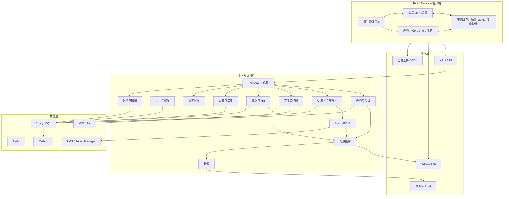
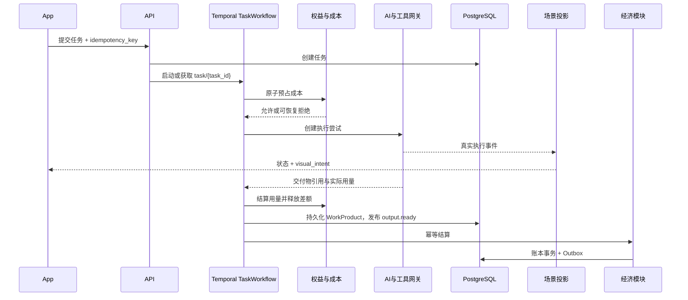

# 数字员工 App 技术设计

> 文档状态：技术方案讨论版 / 可进入技术验证
> 版本：v0.8
> 更新时间：2026-07-21
> 需求基线：《需求设计.md》v0.9
> 适用范围：手机客户端首版高质量垂直切片及后续演进
> 核心结论：采用“React Native 单客户端 + 轻量分层 2D 互动办公室 + 云端耐久任务编排”。

---

## 文档治理

本文把产品规则转换为可实施、可验证、可演进的技术方案。产品行为、首版范围、用户权益和验收口径以《需求设计.md》为准；本文负责客户端边界、数据流、模块职责、资源管线和工程门槛。旧双运行时客户端结论已被新的产品决策推翻，不再作为当前方案或备用路线。

决策标识：**已选基线**可直接进入 PoC；**验证门槛**未通过不得扩大开发或资源生产；**条件式优化**只有触发明确压力门槛才启用；**产品待定**必须由产品决策冻结。

## 1. 技术选型结论

### 1.1 总体方案

| 层级 | 技术基线 | 主要职责 |
|---|---|---|
| 移动客户端 | React Native 0.86.x、TypeScript、New Architecture、Hermes | 顶级导航、办公室、任务、公司、汇报、我的，以及所有业务页面 |
| 场景默认渲染 | `View` / `Image` / `Pressable` | 分层背景、家具、员工、任务道具、前景遮挡和点击热区 |
| 动画与手势 | 与 RN 0.86 兼容且精确锁定的 Reanimated 4、Gesture Handler | UI 线程位移、缩放、淡入、房间聚焦、拖拽和手势竞争 |
| 条件式绘制优化 | React Native Skia `Atlas` | 仅普通 RN 在压力 Gate 失败后迁移角色与任务道具绘制层 |
| 局部复杂动作 | Rive 或 Sprite Atlas | 经 PoC 证明必要的少量核心动作，不承载页面和业务状态 |
| 平台能力 | RN 官方能力与必要的 Swift / Kotlin 模块 | 推送、文件、分享、相机、麦克风、支付、安全存储和后台传输 |
| API 与业务服务 | Node.js 24 LTS、TypeScript、NestJS + Fastify | 账号、任务、组织、人事、经济、权限、查询 API 和事件流 |
| 耐久工作流 | Temporal TypeScript SDK | AI 长任务、等待用户、重试、定时器、人事和工资流程 |
| 主数据库 | PostgreSQL 18 | 业务事实、任务、组织、记忆元数据、账本、审计和幂等记录 |
| 缓存与协调 | Redis 兼容托管服务 | 限流、短期缓存、连接状态和非权威协调数据 |
| 文件与场景资源 | S3 兼容对象存储 + CDN | 用户文件、正式交付物、场景清单和静态资源 |
| 实时与通知 | WebSocket + REST 增量同步 + APNs / FCM | 前台状态、断线恢复和后台通知 |
| 可观测性 | OpenTelemetry + 崩溃、日志、指标和追踪平台 | 任务、成本、客户端性能和版本定位 |

AI 继续采用“平台托管多供应商 + App Store IAP 订阅 + 订阅周期成本配额”。用户不提供 API Key；每次任务在执行前原子预占成本，执行后按价格版本和实际用量结算。搜索、OCR、文件解析和外部工具同样进入成本账本与预算上限。

### 1.2 选择理由与明确边界

产品需要的是竖屏、轻量、可读、可点击的互动办公室，而不是自由空间模拟。固定房间、有限姿态、语义槽位、显式遮挡和受控并发可以由同一 React Native 树稳定表达，并与原生文字、支付、文件和无障碍共享导航、生命周期、内存和发布链路。

当前方案明确：

- 只维护一个 React Native 客户端和一套 TypeScript 场景状态；
- 不使用 WebView、Three.js 或额外场景运行时；
- 不支持自由旋转、真实物理或任意家具摆放；
- 场景点击只产生用户意图，不能直接改写任务、人事、资产或账务；
- 普通 RN 渲染是产品基线，Skia 只是同一产品内的条件式绘制层迁移；
- 正式结果、长文、支付、文件、Sheet、卡片、标签、气泡和无障碍全部由原生 RN UI 承担。

### 1.3 版本冻结原则

- React Native 固定在 0.86.x 的已验证补丁，启用 New Architecture 与 Hermes；
- Reanimated 4 和 Gesture Handler 必须选用与 RN 0.86 双平台兼容的具体补丁；PoC 通过后把精确版本、锁文件、安装步骤和兼容矩阵提交版本库，本文不提前猜测未经验证的补丁号；
- Skia 与 Rive 若被启用，也必须按相同流程冻结具体版本和回归矩阵；
- Node.js 当前基线为 24 LTS，PostgreSQL 当前基线为 18；
- Alpha、Beta、RC 不进入发布分支，除非存在阻塞问题并有书面风险接受；
- 依赖升级必须重跑场景性能、生命周期、无障碍、IAP 和端到端恢复测试。

### 1.4 决策信心

单客户端方案的工程信心评估 **>95%**：组件边界、语义数据、绘制能力和性能退出条件均明确，且不会把业务状态绑定到另一套运行时。该比例是工程准备度，不是未经真机和用户验证的发布成功概率。主观美术效果只通过黄金视觉签字控制风险，不宣称未经验证必然成功。

## 2. 需求约束转换

### 2.1 不可违反的技术不变量

1. **服务端事实权威**：任务、AI、人事、时间、权益和账务状态以服务端为准，客户端不得自行改写。
2. **演出只做投影**：视觉动作完成不能反向宣告 AI 或业务已完成。
3. **AI 与演出并行**：信息充足后 AI 立即开始，不等待员工移动或动作结束。
4. **结果不被动画阻塞**：`output.ready` 后可立即打开结果，跳过演出不影响交付。
5. **人格不改事实**：人格只影响短汇报和姿态，不修改正式交付物的事实、数字、来源和限制。
6. **可重试写操作幂等**：提交、结算、发薪、购买、删除和未来外部操作均携带幂等键。
7. **账本由服务端计算**：余额、利润、工资应付、权益和资产变更只能由服务端事务产生。
8. **后台不持续动画**：App 退到后台后停止场景动画；云端任务继续。
9. **核心能力不依赖场景**：任务、结果、人事、财务、文件、支付和设置都有标准原生页面。
10. **真实与虚拟分离**：虚拟工资、利润和资产不控制订阅或 AI 算力额度。
11. **成本可预算**：付费 AI 调用前必须完成原子成本预占，不能超过用户与平台上限。
12. **路由不越权也不超支**：供应商切换必须同时满足同意、能力、区域和成本约束。
13. **双账本分离**：供应商成本与用户额度分别记录；失败且无有效交付时不重复扣用户额度。
14. **槽位权威唯一**：每名员工同一时刻只有一个权威 `OfficeSlot`、一个主要动作和一个 `primary_visual_task`。
15. **服务端不发逐帧坐标**：服务端只发送语义槽位、安全状态和视觉意图；客户端按 `layout_version` 映射视觉参数。

### 2.2 首版目标与非目标

首版支持三类 AI 任务；完成“提交任务 → 云端执行 → 真实状态 → 2D 场景演出 → 原生结果 → 幂等结算 → 资产成长”；支持锁屏、退出、断网、被杀和换设备恢复；支持 3 名核心员工、1 名秘书和少量普通员工；支持招聘、考勤、工资、加班、离职或解雇闭环；建立端到端追踪。

办公室首版采用一个竖屏楼层、3—4 个房间、4 名正式员工和 6 个核心姿态作为黄金范围；全景重点显示 4—6 人，当前楼层最多 8 人，同时移动最多 3 人。

首版不实现自由空间编辑、真实碰撞、自由旋转、持续后台模拟、多个智能体自由对话、真实发送邮件或发布内容、大型开放世界、多人实时协作，也不将 Redis、客户端缓存或 Temporal 历史当作业务主数据库。

## 3. 总体系统架构

### 3.1 架构图



### 3.2 服务端风格与职责

首版使用**模块化单体 + 独立工作器**：`api`、`workflow-worker`、`ai-worker`、`file-worker`、`notification-worker`、`scheduler-worker` 和 `asset-cdn`。只有真实证明需要独立扩缩容、故障隔离或合规边界时才拆服务。

| 模块 | 写入权 | 禁止事项 |
|---|---|---|
| Task / Project | 任务主状态、项目、版本、负责人、依赖 | 不直接操作场景或账本 |
| Billing / Entitlement | Apple 交易、订阅状态、权益周期 | 不信任客户端自报购买状态 |
| AI Cost / Usage | 成本预占、供应商成本、用户额度和对账 | 不修改虚拟经济账本 |
| AI Gateway | 执行尝试、模型与工具结果 | 不直接发放项目收入 |
| Visual Projection | `visual_intent`、`SceneSnapshot` | 不成为业务事实来源 |
| Organization / HR | 员工、人事、汇报关系和排班 | 不影响 AI 权益或正式答案 |
| Economy / Ledger | 交易、应付、工资、结算和资产 | 不从客户端余额反推交易 |
| Time / Calendar | 公司时区、日历触发和周期 | 不信任设备本地时间 |
| Memory / Knowledge | 知识、主观记忆、权限和索引 | 不让主观记忆覆盖正式成果 |
| Notification | 通知、合并、去重和偏好 | 不用送达状态代替任务状态 |

### 3.3 仓库结构

```text
apps/
  mobile/                    React Native、iOS、Android、办公室与全部业务页
services/
  api/                       API / BFF
  workers/                   Temporal、AI、文件、通知与定时工作器
packages/
  contracts/                 OpenAPI、事件与场景 Schema
  domain/                    领域类型、状态规则和共享校验
  office-scene/              槽位映射、路径、投影适配与场景组件
  observability/             日志、追踪与指标封装
assets/
  source-2d/                 位图 / 矢量源资产和许可记录
  exported-2d/               双平台验证后的导出资源与 scene manifest
infra/                       环境、部署和监控
tools/                       资源校验、代码生成和数据脚本
docs/                        专项技术文档和决策记录
```

仓库中不存在第二客户端工程，也不存在任何场景专用原生接口。构建产物、缓存、临时导出物和真实用户文件不得提交版本库。

## 4. React Native 客户端与办公室

### 4.1 信息架构与页面边界

顶级导航固定为：**办公室、任务、公司、汇报、我的**。办公室是默认首屏；登录恢复、新手引导、任务创建和列表、项目、审批、正式结果、来源、文件、人事、财务、支付、隐私、导出和删除全部是 RN 页面。

办公室场景负责空间叙事、员工状态、任务道具、房间聚焦和意图入口。原生 UI 负责文字、标签、气泡、卡片、Sheet、长文、支付、文件、系统分享和无障碍。任何场景点击都只返回 `SceneUserIntent`，由路由或命令确认层处理；点击员工、房间或任务不能直接改变业务状态。

### 4.2 场景分层

从后到前固定为：

```text
background
floor
rear-furniture
actors-and-props
front-mask
native-overlays
```

- `background`：窗外、天空、远景和日夜色调；
- `floor`：地面、墙面和不可交互结构；
- `rear-furniture`：桌椅、柜体和后层装饰；
- `actors-and-props`：透明员工、任务文件、电话和有限动态道具；
- `front-mask`：前墙、前景家具、门框和遮挡切片；
- `native-overlays`：姓名、状态、气泡、热区、导航、Sheet 和无障碍节点。

每个元素必须显式声明 `zIndex`。路径节点携带遮挡区段或层级提示；员工移动时按当前路径节点和目标槽位计算层级，不使用隐式数组顺序。文字与交互热区不得烘焙进背景。

### 4.3 资源格式基线

- 背景可使用经 iOS / Android 真机验证的 JPEG、PNG 或静态 WebP；
- 透明员工、任务道具和遮挡层优先 PNG，静态 WebP 只有通过透明边界、色彩和内存验证后使用；
- 动画 WebP 不作为唯一基线，不能让关键姿态依赖单一解码路径；
- 员工使用有限姿态；复杂动作仅局部使用 Rive 或 Sprite Atlas，并提供静态姿态替代；
- 位移、缩放、淡入和房间聚焦由 Reanimated 工作线程完成；JS 线程只处理语义状态和低频事件；
- 不为每帧位置变化触发 React 状态更新，不把服务端事件转换为高频网络坐标。

### 4.4 语义场景数据

核心类型如下：

```ts
type OfficeSlot = {
  slotId: string;
  roomId: string;
  slotType: 'desk' | 'meeting' | 'report' | 'door' | 'archive' | 'idle';
  normalizedX: number;
  normalizedY: number;
  scale: number;
  zIndex: number;
  facing: 'left' | 'right' | 'front';
  labelAnchor: { x: number; y: number };
  supportedPoses: string[];
};

type OfficePath = {
  pathId: string;
  fromSlotId: string;
  toSlotId: string;
  nodes: Array<{ x: number; y: number; zIndex: number; facing?: 'left' | 'right' }>;
};

type EmployeeSceneState = {
  employeeId: string;
  authoritativeSlotId: string;
  primaryAction: string;
  primaryVisualTask: string | null;
  pose: string;
  pathId?: string;
  motionStartedAt?: string;
};

type SceneSnapshot = {
  sceneVersion: number;
  serverSequence: number;
  layoutVersion: string;
  companyTime: string;
  roomStates: Record<string, string>;
  employees: EmployeeSceneState[];
  visualIntents: VisualIntent[];
};

type VisualIntent = {
  intentId: string;
  sourceEventId: string;
  employeeId: string;
  taskId?: string;
  intentType: string;
  targetSlotId?: string;
  priority: number;
  interruptPolicy: 'queue' | 'replace' | 'ignore_if_busy';
  validUntil?: string;
  safeProgressSemantic: string;
};
```

服务端发送语义槽位、真实安全状态和 `visual_intent`。客户端使用 `layout_version` 查找 `OfficeSlot` / `OfficePath`，映射 normalized x/y、scale、zIndex、facing、labelAnchor 和 supportedPoses。布局版本未知、路径缺失或姿态不支持时，回退到安全槽位和静态姿态，并请求完整快照。

### 4.5 人数、并发与权威规则

- 全景重点显示 4—6 人，当前楼层最多 8 人；
- 同时移动最多 3 人，超出的移动意图按优先级排队或以原地姿态表达；
- 每人一个权威槽位、一个主要动作和一个 `primary_visual_task`；
- 同一员工管理多个任务时，只有一个任务驱动主要动作，其他任务由文件堆、秘书摘要或状态卡表达；
- 员工移动中使用 `in_transit` 本地表现，但服务端权威仍是起点或已确认目标；
- 本地动画结束只生成分析确认，不推进业务状态；
- 快照替换本地视觉事实，断线后丢弃无法与新快照对齐的动作队列。

### 4.6 状态、网络与恢复

| 状态 | 来源 | 本地处理 |
|---|---|---|
| 业务状态 | REST / WebSocket | 规范化缓存，按对象版本更新 |
| 场景快照 | Projection | 只读 Store，按 `sceneVersion` 替换 |
| 页面 UI | RN | 页面或轻量 UI Store |
| 草稿 | 加密本地存储 | 可恢复、可删除 |
| 上传文件 | 平台文件系统 | 保存安全引用，不写普通日志 |
| 同步游标 | 加密本地存储 | 重连请求增量 |

REST 负责命令、查询、分页、上传授权和完整快照；WebSocket 负责前台增量。重连携带最后连续确认的 `server_sequence`，服务端返回增量或要求全量快照。后台不依赖长连接，完成与阻塞使用推送；推送只携带最小对象 ID，打开后重新查询服务端。

App 进入后台时停止场景动画和计时器；回到前台先查询增量或快照，再恢复视觉状态。连续 50 次前后台切换必须无重复员工、错误槽位、旧动作回放或业务状态错乱。

### 4.7 无障碍和减少动态效果

- 场景中的员工、房间和任务具有原生语义节点、可读名称、角色和操作；
- 触控热区不小于平台建议，且与透明图像边界解耦；
- 开启减少动态效果后，长路径移动和镜头平移替换为短淡入或直接切换；
- 动态字体、屏幕阅读、颜色对比、焦点顺序和系统分享按原生页面验收；
- 资源缺失或性能降级时，办公室仍显示同一语义状态和原生入口，不降低 AI、结果、人事或财务能力。

### 4.8 结果交付序列

```text
AI Worker 持久化 WorkProduct 与 PersonaReport
→ 服务端发布 output.ready
→ RN 场景让员工整理并走向汇报槽位
→ 场景出现“查看汇报”原生入口
→ 用户触发 openResult(task_id, work_product_version)
→ 原生员工汇报页重新查询权威 WorkProduct
→ 展示正文、来源、限制、文件与操作
→ 返回办公室后重新获取并应用 SceneSnapshot
```

没有另一套运行时需要暂停。结果页本身是普通 RN 路由，场景组件卸载或失焦即可停止动画。`output.ready` 前不得提前走向汇报槽位或显示完成徽标；结果已可用时可跳过整理和走路立即打开。多个完成任务由秘书汇报收件箱聚合，不连续强制跳转。

员工汇报页至少包含员工身份与两行内 `PersonaReport`、权威 `WorkProduct`、来源、时效、限制、未解决问题、交付物引用，以及复制、系统分享、导出、追问和退回修改。虚拟结算展示在正式结果之后，不遮挡答案。

## 5. 服务端与任务编排

### 5.1 技术结构

服务端使用 Node.js 24 LTS、TypeScript、NestJS 与 Fastify。内部模块包括 Identity、Billing、Entitlement / AI Cost、Task、AI Gateway、File、Organization、HR、Economy、Time、Memory、Projection、Notification 和 Audit。共享 TypeScript Schema 不代表共享进程权限；AI、文件和业务工作器必须隔离服务身份与网络权限。

### 5.2 Temporal 耐久任务

每个任务使用稳定 Workflow ID `task/{task_id}`。重复提交返回既有流程，不启动第二个任务。



Temporal 用于 AI 调用、等待用户、文件处理、审批、结算、通知、工资周期、入离职、导出和删除。Workflow 必须确定性；时间、随机数、网络、数据库和模型调用放入 Activity；Activity 默认可重放，所有副作用仍须幂等。大文件、完整提示词、流式文本和二进制不进入 History，只保存安全引用。长历史使用 Continue-As-New；升级必须做版本标记和 Replay 测试。PostgreSQL 仍是任务、人事和账本权威。

### 5.3 状态与真实进度

`Task.status` 仅由 Task 模块写入；`Task.ai_status` 由 AI Gateway 的执行尝试投影；`Task.visual_stage` 由 Projection 计算；`Employee.employment_status` 由 HR 写入；场景槽位由 Projection 维护；`TaskSettlement` 与 `FinanceTransaction` 由 Economy / Ledger 写入。所有转换记录对象 ID、前后状态、版本、触发方、UTC 时间、公司时区、执行尝试和追踪 ID。

AI Gateway 只发布可验证事件：`execution.queued`、`model.started`、`tool.started`、`tool.completed`、`tool.failed`、`file.parsing`、`file.parsed`、`generation.streaming`、`validation.started`、`validation.completed`、`execution.blocked`、`execution.resumed`、`output.ready`、`execution.failed` 和 `execution.canceled`。无法获得细分进度时只显示通用处理中，不猜测百分比。

### 5.4 AI Gateway、IAP 与成本

普通用户不提供供应商密钥。平台供应商凭据按环境、区域和供应商存入 KMS / Secret Manager；普通数据库只保存 `credential_reference`，客户端、Temporal History、日志、追踪和客服后台均不得接触明文密钥。

路由顺序固定为：

```text
任务类型 + 快速 / 标准 / 深度模式
→ 能力与质量门槛
→ 用户同意 + 数据区域 / 保留政策
→ 单任务上限 + 权益周期剩余成本
→ 延迟、限流、健康和平台支出上限
→ 已验证主模型或备用模型
```

PostgreSQL 使用权益周期行锁或条件更新，保证 `settled_cost + reserved_cost + new_reservation <= cycle_limit`。Redis 只做频率和并发限制。执行后按当次 `ModelPriceVersion` 和实际用量结算；供应商切换若可能超过预占，必须重新预占。用户额度 80% 和 95% 提醒，100% 停止新付费任务；平台日预算 70% 告警、85% 停止高级自动路由、100% 只允许已预占任务继续。

App 内持续数字服务只通过 App Store IAP 自动续期订阅销售。客户端使用 StoreKit 2 和不可逆推导账号身份的 `appAccountToken`；服务端通过 App Store Server Notifications V2 与 Server API 维护权威订阅、退款、撤销、宽限期、过期和恢复购买。供应商成本账本、用户额度账本、虚拟公司资金账本三者分离。

当前优先 PoC 可实现 `deepseek_v4` Adapter，但只是验证顺序，不改变多供应商结构。使用官方端点和后台允许清单；模型名、价格和能力通过配置与契约测试获取，不写死过期别名。PoC 仅使用合成或非敏感数据，并验证普通响应、SSE、取消、结构化输出、工具调用、用量和稳定错误映射。

### 5.5 正式成果与人格

```text
用户要求 + 项目上下文 + 正式公司知识
→ 统一生成真实交付物
→ 安全与事实一致性检查
→ canonical WorkProduct
→ PersonaReport 短汇报
→ 校验没有新增或修改数字、来源、结论和限制
```

`WorkProduct` 至少包含内容块、事实声明、数字与单位、来源、限制、未解决问题和交付引用。`PersonaReport` 的事实必须引用既有 `claim_id`；校验失败回退标准模板，不阻塞正式结果。三类任务各不少于 150 条样本，总计不少于 450 条；任一 Adapter、模型、价格、Prompt、检索或工具升级都必须重跑对应评测。

### 5.6 文件处理

```text
创建 upload_session
→ 签名分片直传
→ 大小、类型、校验和与恶意内容检查
→ 隔离解析 / OCR / 表格抽取
→ 页码、工作表和单元格定位
→ 权限化全文 / 向量索引
→ 生成可引用输入
```

白名单为 PDF、DOCX、XLSX、CSV、TXT、PNG、JPEG，普通单文件上限 25 MB。ZIP、可执行文件、含宏文档和任意嵌套容器不进入首版解析白名单。解析器设置 CPU、内存、页数、单元格和超时限制；原文件、派生物和正式结果使用不同对象前缀与保留策略；来源删除必须同步使缩略图、解析产物、索引和任务引用失效。

### 5.7 HR、时间与经济

人事申请与生效命令分离。离职、解雇、调岗和请假在事务或 Saga 中更新任务交接、权限、工位槽位和工资；员工不可用只触发重新分配或显式召回，不暂停底层 AI；最终离职必须有截止和升级路径。

数据库存 UTC 与 IANA 公司时区。每日事件使用 `(company_id, local_date, event_type, rule_version)` 幂等。非工作时间默认 `dispatch_mode=overtime`，用户可切换 `phone_recall`；两者只影响演出、人事记录和虚拟成本，AI 都立即执行。`OvertimeSession` 按员工、当地日和规则版本去重，`PhoneRecallEvent` 按 `root_task_id` 去重。

`FinanceTransaction` 是余额权威；`TaskSettlement` 使用稳定 `settlement_unit_key`，同一单元只有一条成功记录。收入、费用、工资应付和现金付款分开记账；发薪只结清应付；更正使用冲正，不删除历史。当地日前 5 个有效根任务获 100% 虚拟收入、第 6—10 个 50%、之后 20%；只影响虚拟收入，不限制 AI 权益。

### 5.8 记忆、知识和外部操作

检索先按 `company_id`、项目、访问等级和员工身份过滤，再做关键词与向量召回、重排和上下文预算。客观知识与员工主观记忆分层；每条持久记忆包含 `source_ref`、`scope`、`confidence`、`created_at`、`expires_at`、`supersedes` 和 `deletion_state`。无来源摘要不能晋升为客观知识；主观记忆默认 90 天衰减。

首版只生成邮件、日程或发布草稿。未来真实操作必须经过结构化提案、权限与风险检查、原生确认、短期授权、第三方回执和幂等状态更新。

## 6. 事件协议与场景投影

### 6.1 领域事件

领域事件包含 `event_id`、`event_type`、聚合类型与 ID、`company_id`、聚合版本、`server_sequence`、发生时间、公司时区、`trace_id`、actor 和 payload。事件与业务事务一起写入 Outbox；消费者按 `event_id` 去重，按聚合版本拒绝倒序覆盖。

### 6.2 视觉意图

服务端不发送逐帧坐标和时长脚本，而发送抽象 `visual_intent`：

| 业务事实 | 意图 | 可选 2D 表现 |
|---|---|---|
| 任务已接收 | `receive_task` | 接文件、看卡片、点头 |
| AI 正在处理 | `work_on_task` | 打字、阅读、整理 |
| 工具开始搜索 | `consult_sources` | 走向资料槽位、查看资料 |
| 等待用户补充 | `ask_boss` | 到汇报槽位、显示原生气泡 |
| 进入验证 | `review_output` | 检查文件、会议槽位复核 |
| 结果待交付 | `deliver_result` | 整理、走向汇报槽位 |
| 工具失败 | `report_system_issue` | 故障状态卡，不归咎员工 |
| 员工下班 | `leave_office` | 收拾、离开、场景变暗 |

`safe_progress_semantic` 只能来自已确认事实。客户端按员工人格、资源可用性、减少动态效果和 supportedPoses 选择姿态变体，但不能改变语义。

### 6.3 快照与一致性

Projection 输入任务与 AI 状态、员工在职与排班、公司时间、布局版本、负责人、视觉参与者、保密等级和观看偏好；输出 `SceneSnapshot`、员工槽位、主要动作、房间状态、任务道具和意图队列。投影失败时回退通用处理中和标准任务列表，不虚构细节。

快照至少包含 `scene_version`、`server_sequence`、`layout_version`、公司时间、房间状态、员工槽位与主要动作、任务道具和关键意图；不包含完整结果、用户文件正文、令牌或供应商密钥。关键交付不等待视觉确认。

## 7. 轻量分层 2D 办公室实现

### 7.1 组件结构

```text
OfficeScreen
├── OfficeViewport
│   ├── BackgroundLayer
│   ├── FloorLayer
│   ├── RearFurnitureLayer
│   ├── ActorsAndPropsLayer
│   └── FrontMaskLayer
├── NativeOverlayLayer
│   ├── EmployeeLabels
│   ├── StatusBubbles
│   ├── InteractionHotspots
│   └── FocusControls
└── OfficeSheetHost
```

`OfficeViewport` 只消费可序列化的场景视图模型。每名员工由 `EmployeeSprite`、`PoseResolver`、`SlotMotionController`、`InteractionHotspot` 和 `SceneAccessibilityNode` 组成。组件不得调用模型、修改任务状态或直接写账本。

### 7.2 移动、缩放与聚焦

- 画布使用 normalized 坐标适配安全区与不同屏幕比例；
- 全景默认容纳所有 3—4 个房间和 4—6 名重点员工；
- 双指缩放和受限平移由 Gesture Handler 协调，提供“回到全景”；
- 点击员工或房间以 Reanimated 完成受限缩放、平移和淡入聚焦；
- 无自由旋转；聚焦不改变房间拓扑；
- `OfficePath.nodes` 通过分段 timing 或 easing 连接，节点切换时更新 facing 和 zIndex；
- 路径缺失、目标不可达或减少动态效果开启时，使用短淡入切换到安全槽位；
- 动画完成回调只清理本地队列，不发业务完成命令。

### 7.3 姿态与动作

首版至少定义 6 个核心语义姿态：`idle`、`walk`、`work`、`read`、`report`、`blocked`。可增加 `phone`、`meeting`、`overtime` 等局部变体，但每个员工同一时刻只显示一个主要姿态。透明边界、脚底锚点、标签锚点和面对方向必须由 manifest 声明。

复杂动作必须满足：局部使用、可中断、有静态替代、不会承载文字或业务状态、真机内存与帧时间通过。若 Rive 与图集均无明显体验收益，保持有限 PNG 姿态。

### 7.4 普通 RN 与 Skia 条件切换

默认实现使用普通 RN 组件。只有在规定压力夹具上完成两轮定向优化后仍未通过性能 Gate，才把 `actors-and-props` 的绘制实现替换为 Skia `Atlas`。迁移边界只包括角色与任务道具批量绘制；背景、遮挡、标签、气泡、点击热区、Sheet、长文、支付、文件和无障碍继续使用普通 RN。

两种绘制实现必须消费同一 `OfficeSlot`、`OfficePath`、`EmployeeSceneState`、`SceneSnapshot` 和 `visual_intent`，保持同一产品、同一交互、同一业务能力。Skia 不是独立降级路线，也不得成为提前扩大复杂度的理由。

## 8. 2D 资源与 scene manifest

### 8.1 黄金视觉 Gate

批量生产前只完成：1 个竖屏办公室、3—4 个房间、4 名正式员工、6 个核心姿态、日 / 夜两套状态、全景 / 房间聚焦。必须在目标 iPhone 和 Android 真机上验证构图、角色辨识、遮挡、标签、动态字体、减少动态效果和商业授权，并由产品与视觉负责人书面签字。未签字不得批量生产；主观风格风险只通过该 Gate 管理。

### 8.2 scene manifest

```json
{
  "layoutVersion": "office-v1",
  "canvas": {"designWidth": 1170, "designHeight": 2532},
  "layers": ["background", "floor", "rear-furniture", "actors-and-props", "front-mask", "native-overlays"],
  "assets": [],
  "rooms": [],
  "slots": [],
  "paths": [],
  "occlusionZones": [],
  "dayNightVariants": {},
  "licenseManifestVersion": "licenses-v1"
}
```

每个资源记录稳定 `asset_id`、源文件引用、导出格式、像素尺寸、倍率、色彩空间、透明边界、压缩方式、目标平台、许可、作者、来源、到期或限制。每个角色姿态记录脚底锚点、标签锚点、facing、透明包围盒和支持员工集合。每个槽位记录房间、语义类型、normalized x/y、scale、zIndex、facing、labelAnchor、supportedPoses；每条路径记录节点、层级和遮挡穿越信息。

### 8.3 资源流水线与自动校验

```text
位图 / 矢量源资产 + 许可记录
→ 固定导出预设与尺寸
→ 透明边界、锚点和命名检查
→ 双平台解码、色彩和内存检查
→ scene manifest 引用完整性检查
→ 黄金截图与遮挡回归
→ 签名资源包 / CDN
```

CI 至少检查：尺寸与倍率、格式白名单、透明像素边界、脚底与标签锚点、槽位范围、路径端点、显式 zIndex、遮挡区域、未引用资源、重复 ID、许可缺失或过期、压缩预算、哈希和 manifest Schema。P0 错误阻止合并与发布。公共资源与用户业务数据使用不同存储前缀和权限。

### 8.4 资源预算

预算以真机测量冻结，不以源文件体积代替运行内存。首包只内置黄金办公室、核心员工、静态替代姿态和安全回退资源；非首屏资源按版本下载并保留上一稳定 manifest。缓存设磁盘上限与 LRU，但不得删除当前布局必需资源。远端资源更新必须签名、可回滚并与最低 App 版本兼容。

## 9. 性能、内存与质量 Gate

### 9.1 正式压力场景

使用 Release 真机包运行：4 个房间、8 名员工、3 个并行动画、1 个气泡、2 个展开标签，持续 20 分钟。必须同时覆盖冷启动进入、全景与聚焦切换、结果页往返、前后台与网络恢复。

### 9.2 通过标准

| 项目 | 目标 |
|---|---|
| 场景流畅度 | 接近稳定 60 FPS，不以平均值掩盖长帧 |
| UI 帧时间 | P95 ≤ 20 ms |
| 严重卡顿 | 非加载帧 >100 ms ≤ 1 次 / 分钟 |
| 场景增量内存 | 相对无办公室基线目标 ≤120 MB |
| 生命周期 | 50 次前后台无状态错乱、重复员工或旧动作回放 |
| 业务恢复 | 丢失本地动画队列后按最新快照恢复 |
| 点击响应 | 常规交互 P95 ≤200 ms |
| 结果可见 | `output.ready` 后跳过演出可立即进入结果 |

编辑器、模拟器和开发包不能用于通过 Gate。记录 Xcode / Android 平台性能数据、Hermes、React Native 性能标记、内存快照、热状态和崩溃信息。

### 9.3 优化顺序

1. 消除无关 React 重渲染，拆分 selector，稳定 key 与 memo 边界；
2. 把连续动画留在 Reanimated 工作线程，减少 JS 回调和跨线程对象分配；
3. 压缩与按需解码图片，控制透明大图覆盖与同时驻留；
4. 降低不可见员工更新，限制 8 人 / 3 移动并发；
5. 合并静态背景层，减少阴影、模糊和频繁布局；
6. 检查标签、气泡和无障碍节点是否造成布局抖动；
7. 完成两轮优化仍失败，才迁移 `actors-and-props` 到 Skia `Atlas`；
8. 迁移后用完全相同夹具重新验收，不降低人数、动画或业务能力来伪造通过。

### 9.4 热量、电量与后台

后台停止场景动画；云端任务不依赖手机 CPU 或后台时间。大文件上传尊重蜂窝、低电量和平台限制。无交互且无关键动画时暂停非必要循环；结果页停留期间办公室路由不运行。性能指标不得包含用户原文。

## 10. 数据存储与一致性

### 10.1 数据分层

| 数据 | 权威存储 | 缓存 / 派生 |
|---|---|---|
| 用户、公司、成员与权限 | PostgreSQL | 客户端会话缓存 |
| Apple 订阅与权益周期 | PostgreSQL，保存已验证交易索引 | 权益快照 |
| 任务、项目与执行尝试 | PostgreSQL | Redis 热查询、移动查询缓存 |
| AI 供应商、模型与价格版本 | PostgreSQL，仅保存凭据引用 | 健康、能力、价格和路由缓存 |
| 平台供应商密钥 | KMS / Secret Manager | AI Worker 受控临时内存 |
| 成本预占、供应商成本、用户额度 | PostgreSQL 追加记录 | Redis 频率 / 并发门禁 |
| AI 输出与用户文件 | 对象存储 + PostgreSQL 元数据 | 短期下载缓存 |
| 员工、人事、排班和权威槽位 | PostgreSQL | `SceneSnapshot` |
| 账本、结算、工资和资产 | PostgreSQL | 可重建余额与报表 |
| 知识与记忆 | PostgreSQL + 对象存储 | 全文 / 向量索引 |
| 工作流历史 | Temporal | 业务状态投影到 PostgreSQL |
| 公共 2D 资源 | 对象存储 / CDN | 签名 manifest 与本地缓存 |

缓存丢失不得造成任务、余额、人事、正式成果或权益丢失。所有公司数据带 `company_id`；服务端从 `CompanyMembership` 校验租户，不信任客户端传入的公司 ID。关键表可用 PostgreSQL RLS 纵深保护。

普通实体使用 `version` 乐观锁；任务使用 `status_version` 和合法转换；结算、发薪、购买、权益和删除使用唯一业务键与数据库约束。高影响命令携带 `expected_version`。统一 `IdempotencyRecord` 保存 scope、key、请求哈希、actor、公司、状态和响应引用；同键不同请求必须冲突。

### 10.2 账本、Outbox 与删除

任务结算在单个 PostgreSQL 事务中锁定 `settlement_unit_key`，写入 TaskSettlement、FinanceTransaction、余额版本、员工经历、资产条件和 Outbox。AI 成本结算锁定 UsageReservation 与 EntitlementCycle，按价格版本写 ProviderUsageLedgerEntry 和 UserAllowanceLedgerEntry，释放未使用预占。金额使用整数微单位，不使用浮点数。

业务表和 Outbox 同事务写入；消费者按 `event_id` 去重。移动视图、场景和分析都是可重建投影。删除由耐久 `DataDeletionWorkflow` 完成身份确认、冻结新写入、删除或匿名化主数据、对象正文与派生物、全文与向量索引、角色记忆、第三方删除回执和不含正文的完成审计。

PostgreSQL 开启高可用、备份和时间点恢复；对象存储使用版本保护并遵守主动删除政策；每季度演练数据库、对象和工作流恢复，之后执行任务、账本、结算与对象引用对账。

## 11. API 与实时协议

外部移动 API 使用版本化 REST、OpenAPI 和 JSON Schema。命令与查询分离；分页使用稳定游标；时间使用 ISO 8601 UTC 并返回公司时区语义；金额使用整数。主要端点覆盖 upload、subscription、allowance、tasks、projects、office/snapshot、sync、employees、HR、finance、payroll、assets、export 和 delete。

可写请求至少包含 Authorization、Idempotency-Key、X-Client-Version、X-Request-Id、X-Company-Id，需乐观锁时带 If-Match。错误结构提供稳定 code、可本地化 message、retryable、recovery_actions、object_id 和 request_id，不返回堆栈、SQL、提示词或密钥。

WebSocket 连接执行 authenticate → subscribe → resume(last sequence) → delta 或 snapshot_required → ack(highest contiguous sequence)。事件包含任务、AI、结果、结算、待办、人事、时间、经济、通知和场景投影。背压时可合并可重建视觉事件，不得丢失结果可用、等待用户、失败、结算和安全事件。文件与完整结果不通过 WebSocket 传输。

API、领域事件、scene manifest 和 App 各自有版本。新增字段默认兼容，客户端忽略未知字段；不兼容变化先双读 / 双写再迁移。服务端维护最低支持 App 版本，强制升级只用于安全、数据损坏或无法兼容的问题。

## 12. 安全、隐私与 AI 防护

移动输入、用户文件、模型输出、网页、工具结果、推送参数、深链和远端 manifest 全部视为不可信。关键权限、状态、金额、文件访问和外部操作必须服务端验证。

- 使用标准 OIDC / OAuth 2.1；短期访问令牌与安全存储中的刷新令牌；高风险操作要求近期登录；
- 公司权限由 Membership 与角色策略决定，组织角色不自动等于数据权限；
- 数据库、对象、备份和日志加密；签名 URL 短期、限对象和内容；环境与区域凭据隔离；
- 文件名、MIME、扩展名、签名和内容特征交叉校验；解析器不能访问管理网络或云元数据；
- 外部内容只作为不可信数据，不能修改系统规则、工具白名单、用户授权或成本上限；
- 工具调用按结构化 Schema 校验，网络出口有域名、跳转、超时和大小限制；
- 每个 AI 供应商配置关联版本化 ConsentRecord；供应商、域名或用途实质变化时重新同意；
- 默认不记录问题、文件、结果、语音和记忆原文；分析属性白名单；崩溃日志清理路径、URL 参数和令牌；
- 未保存到项目的原文件默认任务完成后 30 天删除，临时 OCR / 解析产物 7 天，业务日志 30 天，匿名聚合指标 90 天；在线来源删除后 24 小时内移除索引；
- 公司创建时绑定 `data_region`，没有合法、已同意、能力满足且预算内候选时任务明确阻塞，不静默跨区或换供应商。

威胁模型覆盖跨租户、缓存污染、重复提交与结算、文件解析、SSRF、Prompt Injection、工具越权、账号接管、深链劫持、远端资源篡改、支付回执伪造、删除不完整、内部权限、供应商密钥泄露、价格篡改、成本竞态、App Store 通知重放和供应链风险。

## 13. 部署、发布与可观测性

设置 Local、Development、Staging、Production 和 Asset Preview；环境不共享数据库、对象前缀、推送证书、支付密钥或模型密钥。首版优先托管容器、PostgreSQL、Redis、对象存储、CDN、Temporal、KMS、WAF、日志、指标和追踪；在首发地区冻结前不锁死云厂商，也不为假设的多云提前维护集群。

CI / CD：

```text
格式与静态检查
→ 单元、契约、Replay、迁移与安全测试
→ 构建不可变服务镜像和 RN 双平台 Release 包
→ scene manifest 与资源自动校验
→ Staging 集成、真机性能和冒烟
→ 分阶段 Production
→ 服务、App 与资源独立回滚
```

数据库迁移使用扩展—迁移—收缩；大表分批回填；财务、任务和权限迁移必须有对账与回滚。远端配置可控制已验证 AI 路由、预算阈值、动画观看默认值、资源版本、任务模板和非核心实验，但不能绕过审核加载可执行逻辑，不能关闭安全、租户、删除、幂等或账本约束。

每个任务贯穿 request_id、trace_id、task_id、workflow_id、run_id、execution_attempt_id、tool_call_id、settlement_id、notification_id、client_session_id、scene_version 和 layout_version。指标覆盖任务成功与时延、AI 用量与成本、供应商账单差异、文件解析、IAP 权益、RN 启动、UI 帧时间、长帧、内存、场景快照恢复、崩溃、API、Temporal、PostgreSQL、Outbox 和对象存储。追踪标签不得放用户原文。

## 14. 测试与质量保证

| 层级 | 重点 |
|---|---|
| 领域单元 / 属性测试 | 状态、人事、时间、经济、权限、幂等、账本守恒和乱序 |
| Temporal Replay | 升级、重试、Signal、Timer 和 Continue-As-New |
| 数据库集成 | 事务、唯一约束、锁、Outbox、迁移和 RLS |
| API / 供应商契约 | OpenAPI、错误、流式、取消、工具、用量和兼容性 |
| AI 评估 | 三类任务、来源、安全、文件和人格事实一致性 |
| RN 组件 | 页面状态、场景层、标签、无障碍、权限和错误恢复 |
| 场景状态机 | 槽位、路径、遮挡、意图优先级、快照和减少动态效果 |
| 资源自动测试 | manifest、尺寸、透明边界、锚点、许可和压缩 |
| 移动 E2E | 提交、后台、推送、结果、结算、人事、支付和删除 |
| 性能 / 安全 | Release 真机压力 Gate、租户、文件、工具、支付和删除 |

真实性测试必须证明：AI 未开始时不显示搜索或验证完成；等待用户时停止生成类表达；系统失败不归咎员工；结果可用后可立即打开；断线不补播旧动作；同一员工不处于两个槽位；同一任务不生成两个主要道具；减少动态效果或资源缺失时仍有正确文字状态。

AI 发布门槛：要求覆盖人工双评平均 ≥4.2/5；可核查声明来源支持率 ≥95%；严重引用错配 <1%；关键文件字段准确率 ≥98%；人格严重事实漂移为 0；成功工具越权为 0；限流、超时和部分工具失败的可恢复或清晰降级率 ≥99%。

真机至少覆盖最低、主流和高档 iPhone / Android，不同 GPU、内存、屏幕比例和刷新率，以及弱网、断网、网络切换、低电量、低存储、热状态、来电、锁屏、内存压力、动态字体、屏幕阅读、减少动态效果和高对比。

发布前不存在已知跨用户访问、重复收入 / 付款或余额不可重建问题；三类任务正常与异常路径通过；性能与黄金视觉 Gate 签字；导出、删除、权限拒绝和恢复端到端通过；服务、模型路由、App 与资源均可独立回滚；P0 告警和手册可用。

## 15. 分阶段实施

### 15.0 阶段 -1：发行与成本门禁

冻结首发地区、目标用户、商业模式和数据区域；完成主备供应商契约、KMS 密钥、StoreKit 2、服务端通知、成本预占、双账本、账单对账、IAP 审核演示、第三方数据同意、团队资源和 P0 范围。未通过《项目落地风险与验证计划.md》Gate -1 / Gate 0，不开始批量视觉生产。

### 15.1 阶段 0A：黄金体验

实现 RN 0.86.x 单客户端、一个竖屏办公室、3—4 个房间、4 名正式员工、6 个姿态、日夜、全景与聚焦；完成一个真实文本任务，状态驱动接单、工作、整理、走向汇报槽位和原生结果页；验证背景 / 透明资源格式、标签、气泡、减少动态效果、授权与视觉签字。

### 15.2 阶段 0B：性能压力

使用普通 RN 实现 4 房间、8 员工、3 并行动画、1 气泡、2 展开标签的 20 分钟 Release 真机夹具；完成 50 次前后台和快照恢复。先做两轮定向优化；仍失败才迁移角色与任务道具绘制层到 Skia `Atlas`，并使用同一夹具复验。

### 15.3 阶段 1：最薄垂直闭环

```text
登录 / 公司初始化
→ 创建文字任务
→ TaskWorkflow + 已验证 AI Adapter
→ 真实状态转 visual_intent
→ RN 员工接单、处理与汇报
→ 原生 WorkProduct 页面
→ 幂等任务结算
→ 余额与一项资产变化
→ 后台与恢复
```

同时实现 PostgreSQL 核心 Schema、Outbox、Temporal、API、WebSocket、推送、追踪、失败、取消、等待补充、基础账本和 E2E。

### 15.4 阶段 2—3：P0 扩展与发布

扩展 IAP、权益、成本、三类任务、文件、3 名核心员工与秘书、HR、工资、资产、项目、知识、导出、删除和无障碍。每增加领域，先完成状态、失败、权限、幂等、埋点和测试，再增加演出。发布前冻结员工、房间、姿态、事件和模板，完成设备矩阵、成本对账、安全、恢复、商店配置、灰度和回滚演练。

团队能力至少覆盖 RN、iOS / Android 平台、2D 视觉与动效、服务端与 PostgreSQL、Temporal、AI 与评估、QA 真机与安全、云平台和发布。不再设置跨多客户端运行时的集成岗位。

## 16. 关键技术风险与控制

| 风险 | 早期信号 | 控制 |
|---|---|---|
| P0 范围过大 | 多链路并行且无人负责 | 阶段门禁、垂直切片、30% 集成余量 |
| IAP / 单位经济失控 | 权益不同步、成本超净收入 | 服务端权益、预占、双账本、价格版本和熔断 |
| RN 场景重渲染 | JS 忙、标签抖动、长帧 | selector、memo、UI 线程动画和压力夹具 |
| 透明大图内存过高 | 解码峰值、后台终止 | 尺寸预算、按需加载、静态格式双平台验证 |
| 场景状态冲突 | 重复员工、错误槽位 | 单一权威槽位、版本、快照与并发 Fixture |
| 动画伪造进度 | 表现领先 AI | 真实事件、safe semantic 与真实性测试 |
| 主观美术不达预期 | 风格争议延迟到批量期 | 黄金视觉签字后才量产 |
| 普通 RN 压力失败 | 8 人 / 3 动画不达 Gate | 两轮优化后条件迁移 Atlas 绘制层 |
| 资源许可或风格不一致 | 来源不明、批次差异 | license manifest、自动阻断和黄金截图 |
| Temporal 重复副作用 | 重复工具或结算 | Activity 幂等、唯一键和对账 |
| 供应商波动 / 密钥泄露 | 错误、价格变动、凭据入日志 | Adapter、KMS、审计、主备和紧急停用 |
| 文件攻击 / 跨租户 | 解析异常、错误索引 | 沙箱、RLS、公司过滤和隔离测试 |
| 虚拟经济错账 | 余额不可重建 | 追加账本、唯一结算和每日对账 |
| 无障碍被场景阻断 | 屏幕阅读无法操作 | 原生语义节点、等价页面和真机验收 |

## 17. 产品阻塞决策的技术建议

- 同屏上限：全景重点 4—6 人，当前楼层最多 8 人，同时移动最多 3 人；
- 美术范围：一个竖屏办公室、3—4 房间、4 正式员工、6 姿态、日夜、全景 / 聚焦先签字；
- 平台：阶段 0 同时验证 iOS / Android，公开发布顺序由产品冻结；
- 文件：PDF、DOCX、XLSX、CSV、TXT、PNG、JPEG，普通单文件 25 MB；
- 模型：平台托管一主一备，只有质量、预算、地区和同意均满足才执行；
- 商业：App Store 自动续期订阅，供应商成本、用户额度与虚拟资金分离；
- 时间：IANA 时区，非工作时间默认加班、可切换召回，均不延迟 AI；
- 保留：采用第 12 章默认值，法律或合同只能缩短；
- 首版内容包和业务指标在黄金视觉与性能 Gate 后冻结。

## 18. 技术完成定义

P0 功能必须同时具备：明确的正常与异常行为；权威状态和合法转换；版本化 API、事件与场景 Schema；客户端与服务端无重复业务事实；重试、并发、取消、恢复和幂等测试；权限、安全、隐私、日志和删除；无障碍等价入口；Release 真机性能与弱网通过；指标、追踪、错误、告警和手册；迁移与回滚；自动测试进入 CI；文档、代码、资源和配置可定位到同一发布。

## 19. 架构决策记录

1. ADR-001：React Native 0.86.x 单客户端；
2. ADR-002：普通 RN 分层 2D 办公室为默认渲染；
3. ADR-003：语义槽位、路径、场景快照和视觉意图；
4. ADR-004：Skia Atlas 仅作为压力失败后的条件式绘制优化；
5. ADR-005：Temporal 耐久任务工作流；
6. ADR-006：PostgreSQL 权威事实、追加账本与 Outbox；
7. ADR-007：App Store IAP、平台托管多供应商与 AI Gateway；
8. ADR-008：scene manifest、2D 源资产、许可与自动校验；
9. ADR-009：服务端现实时间与公司时区；
10. ADR-010：WorkProduct 与 PersonaReport 分层；
11. ADR-011：供应商密钥 KMS 托管和同意记录；
12. ADR-012：订阅周期成本预占和双账本；
13. ADR-013：主备供应商、价格版本和全局熔断；
14. ADR-014：黄金视觉签字与 Release 真机性能 Gate。

架构变化必须记录现状、问题、候选、决定、后果和回滚。新依赖说明维护、许可、包体、安全与退出成本；状态机、账本或权限变化同步需求、Schema、迁移、事件和测试；监控、删除和幂等不能上线后补。

## 20. 后续专项文档

建议依次产出：《RN 场景 PoC 与真机验收表》《OfficeSlot / OfficePath / SceneSnapshot 协议》《scene manifest 与 2D 资源规范》《任务状态机与 Temporal 恢复》《Outbox、WebSocket 与投影》《AI 供应商、IAP、成本、Prompt 与评估》《PostgreSQL 账本与幂等》《文件与删除》《账号、隐私、支付与威胁模型》《现实时间与工资》《端到端发布验收》。

## 21. 官方技术参考

- [React Native 版本](https://reactnative.dev/versions)
- [React Native New Architecture](https://reactnative.dev/architecture/landing-page)
- [React Native Hermes](https://reactnative.dev/docs/hermes)
- [React Native Reanimated 文档](https://docs.swmansion.com/react-native-reanimated/)
- [React Native Gesture Handler 文档](https://docs.swmansion.com/react-native-gesture-handler/)
- [React Native Skia Atlas](https://shopify.github.io/react-native-skia/docs/shapes/atlas/)
- [Rive React Native Runtime](https://rive.app/docs/runtimes/react-native/react-native)
- [Apple Human Interface Guidelines](https://developer.apple.com/design/human-interface-guidelines/)
- [Temporal 官方文档](https://docs.temporal.io/)
- [Temporal TypeScript SDK](https://typescript.temporal.io/)
- [PostgreSQL 18 文档](https://www.postgresql.org/docs/18/)
- [PostgreSQL Row-Level Security](https://www.postgresql.org/docs/18/ddl-rowsecurity.html)
- [OWASP 文件上传安全](https://cheatsheetseries.owasp.org/cheatsheets/File_Upload_Cheat_Sheet.html)
- [OWASP Prompt Injection](https://genai.owasp.org/llmrisk/llm01-prompt-injection/)
- [Apple App Review Guidelines](https://developer.apple.com/app-store/review/guidelines/)
- [Apple 自动续期订阅](https://developer.apple.com/app-store/subscriptions/)
- [App Store Server Notifications V2](https://developer.apple.com/documentation/appstoreservernotifications/app-store-server-notifications-v2)

## 22. 结论

首版以 React Native 单客户端承载全部页面和轻量分层 2D 互动办公室。普通 RN 组件是默认实现；只有严格压力 Gate 失败，才在同一数据与交互模型下把角色和任务道具绘制层迁移到 Skia `Atlas`。服务端继续负责所有真实任务、人事、时间、权益和账务事实，Temporal 负责耐久流程，PostgreSQL 负责一致性与审计。主观美术由黄金视觉签字控制，工程结果由 Release 真机性能、生命周期、安全、IAP、成本、文件和恢复门槛共同决定。